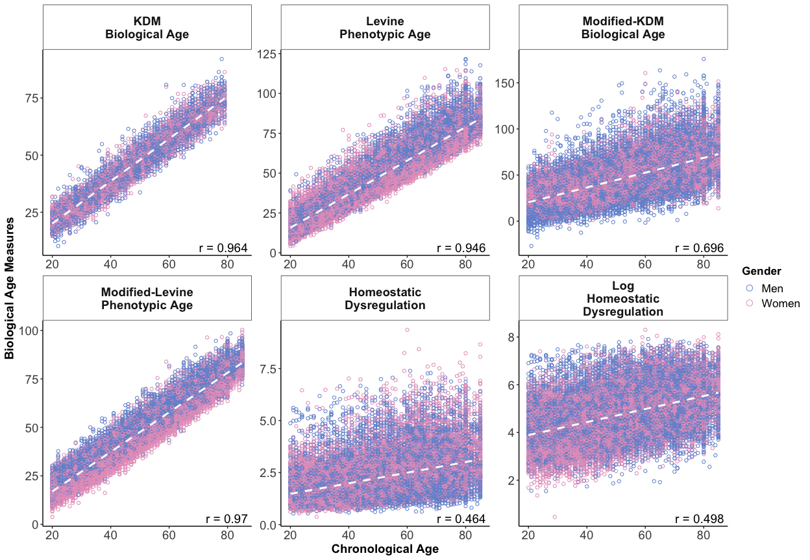

<!-- README.md is generated from README.Rmd. Please edit that file -->

# BioAge

This package measures biological aging using data from the National
Health and Nutrition Examination Survey (NHANES). The package uses
published biomarker algorithms to calculate three biological aging
measures: Klemera-Doubal Method (KDM) biological age, phenotypic age,
and homeostatic dysregulation.

## Installation (via devtools):

You can install the released version of BioAge from
(<https://github.com/dayoonkwon/BioAge>) with:

``` r
install.packages("devtools")
devtools::install_github("dayoonkwon/BioAge")
```

## Example

This serves as an example of training biologial aging measures using the
NHANES III (1988 - 1994) and projecting into NHANES IV (1999 - 2018)
dataset. It also provides documentation for fit parameters contained in
the `BioAge` package. The cleaned NHANES dataset is loaded as the
dataset `NHANES3` and `NHANES4`. The original KDM bioage and phenoage
values are saved as `kdm0` and `phenoage0` as part of NHANES dataset.

``` r
library(BioAge) #topic of example
library(dplyr)
```

## Step 1: train algorithms in NHANES III and project biological aging measures in NHANES IV

I train in the NHANES III and project biological aging measures into the
NHANES IV by using the `hd_nhanes`, `kdm_nhanes`, and `phenoage_nhanes`
function of the `BioAge` package.

``` r
#HD using NHANES (separate training for men and women)
hd = hd_nhanes(biomarkers=c("albumin","alp","lncrp","totchol","lncreat","hba1c","sbp","bun","uap","lymph","mcv","wbc"))

#KDM bioage using NHANES (separate training for men and women)
kdm = kdm_nhanes(biomarkers=c("albumin","alp","lncrp","totchol","lncreat","hba1c","sbp","bun","uap","lymph","mcv","wbc"))

#phenoage uinsg NHANES
phenoage = phenoage_nhanes(biomarkers=c("albumin_gL","alp","lncrp","totchol","lncreat_umol","hba1c","sbp","bun","uap","lymph","mcv","wbc"))
```

## Step 2: compare original KDM bioage and phenoage algorithms with algorithms composed with new biomarker set

The projected data and estimated models are saved as part of the list
structure. The dataset can be drawn by typing `data`. The model can be
drawn by typing `fit`.

``` r
#assemble NHANES IV dataset with projected biological aging measures for analysis
data = merge(hd$data, kdm$data) %>% merge(., phenoage$data)
```

### Figure1. Association of biological aging measures with chronological age in NAHNES IV dataset

In the figure below, the graphs titled “KDM Biological Age” and “Levine
Phenotypic Age” show measures based on the original biomarker sets
published in [Levine 2013 J Geron
A](https://doi.org/10.1093/gerona/gls233) and [Levine et al. 2018
AGING](https://doi.org/10.18632/aging.101414). The remaining graphs
shows the new measures computed with the biomarker set specified within
this code.

``` r
#select biological age variables
agevar = c("kdm0","phenoage0","kdm","phenoage","hd","hd_log")

#prepare labels
label = c("KDM\nBiological Age",
          "Levine\nPhenotypic Age",
          "Modified-KDM\nBiological Age",
          "Modified-Levine\nPhenotypic Age",
          "Homeostatic\nDysregulation",
          "Log\nHomeostatic\nDysregulation")

#plot age vs bioage
plot_ba(data, agevar, label)
```


### Figure2. Correlations among biological aging measures

The figure plots associations among the different biological aging
measures. Cells below the diagonal show scatter plots of the measures
listed above the cell (x-axis) and to the right (y-axis). Cells above
the diagonal show the Pearson correlations for the measures listed below
the cell and to the left. For this analysis, KDM Biological Age and
Levine Phenotypic Age measures are differenced from chronological age
(i.e. plotted values = BA-CA).

``` r
#select biological age variables
agevar = c("kdm_advance0","phenoage_advance0","kdm_advance","phenoage_advance","hd","hd_log")

#prepare lables
#values should be formatted for displaying along diagonal of the plot
#names should be used to match variables and order is preserved
label = c(
  "kdm_advance0"="KDM\nBiological Age\nAdvancement",
  "phenoage_advance0"="Levine\nPhenotypic Age\nAdvancement",
  "kdm_advance"="Modified-KDM\nBiological Age\nAdvancement",
  "phenoage_advance"="Modified-Levine\nPhenotypic Age\nAdvancement",
  "hd" = "Homeostatic\nDysregulation",
  "hd_log" = "Log\nHomeostatic\nDysregulation")

#use variable name to define the axis type ("int" or "float")
axis_type = c(
  "kdm_advance0"="float",
  "phenoage_advance0"="float",
  "kdm_advance"="float",
  "phenoage_advance"="flot",
  "hd"="flot",
  "hd_log"="float")

#plot BAA corplot
plot_baa(data,agevar,label,axis_type)
```

<!-- -->

### Table 1. Associations of biological aging measures with mortality

``` r
table_surv(data, agevar, label)
```


### Table 2. Associations of biological aging measures with healthspan-related characteristics

The linear regression models and sample sizes in “Table 2” and “Table 3”
below are saved as part of the list structure. Regression model can be
drawn by typing `table`. Sample size can be drawn by typing `n`.

``` r
table2 = table_health(data,agevar,outcome = c("health","adl","lnwalk","grip_scaled"), label)

#pull table
table2$table
```


``` r
#pull sample sizes
table2$n
```


### Table 3. Associations of socioeconomic circumstances measures with measures of biological aging

``` r
table3 = table_ses(data,agevar,exposure = c("edu","annual_income","poverty_ratio"), label)

#pull table
table3$table
```


``` r
#pull sample sizes
table3$n
```


