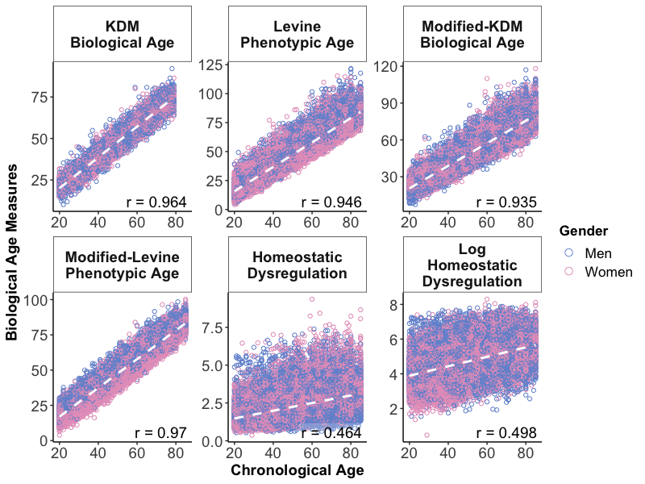
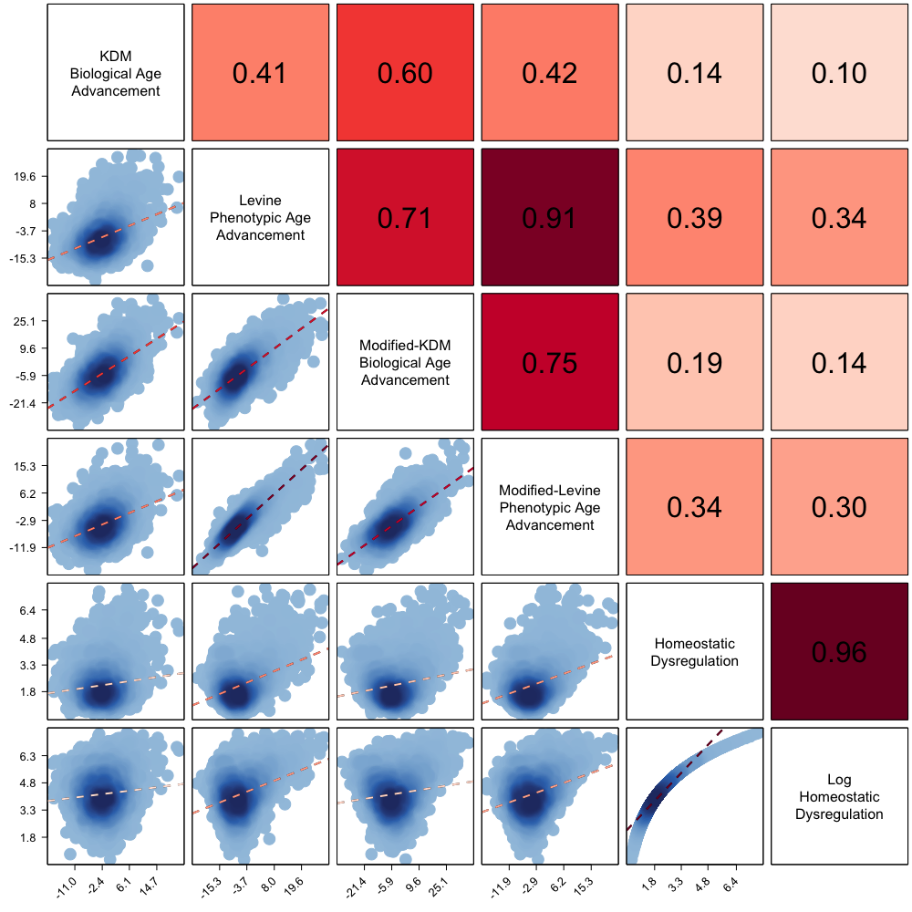
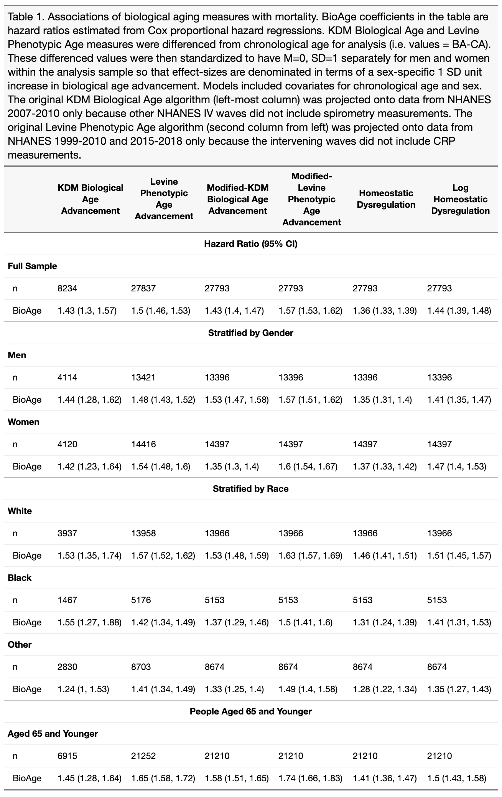
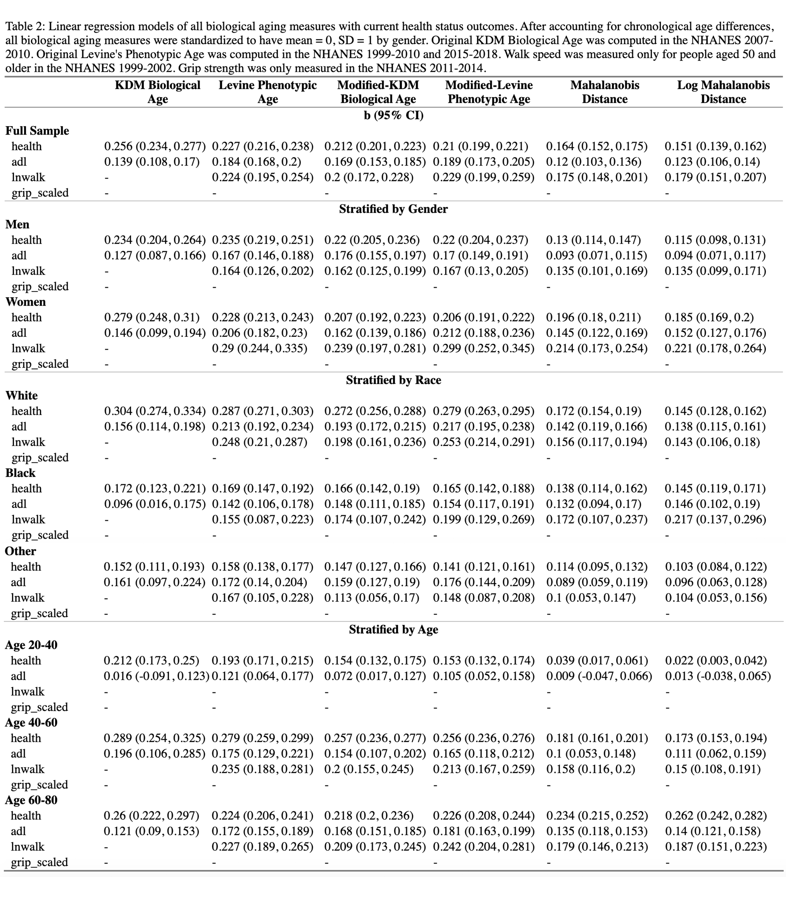
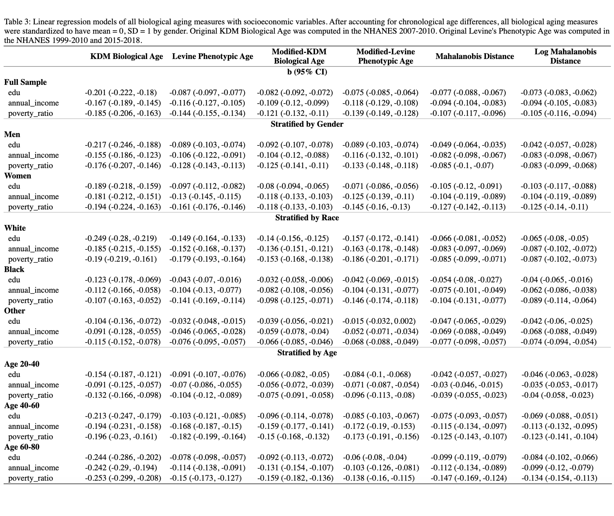
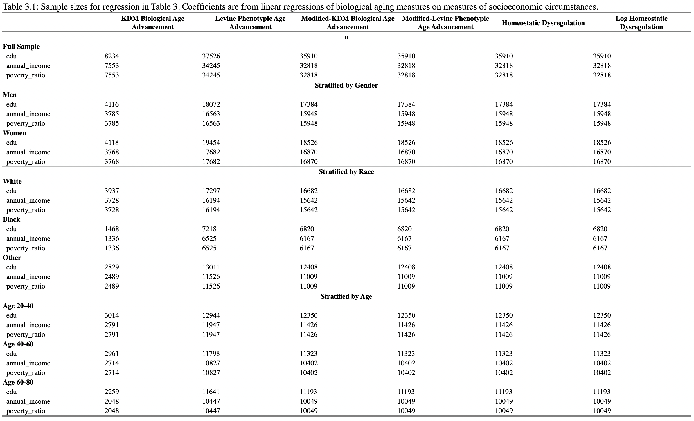

<!-- README.md is generated from README.Rmd. Please edit that file -->

# BioAge

This package measures biological aging using data from the National
Health and Nutrition Examination Survey (NHANES). The package uses
published biomarker algorithms to calculate three biological aging
measures: Klemera-Doubal Method (KDM) biological age, phenotypic age,
and homeostatic dysregulation.

## Installation (via devtools):

You can install the released version of BioAge from
(<https://github.com/dayoonkwon/BioAge>) with:

``` r
install.packages("devtools")
devtools::install_github("dayoonkwon/BioAge")
```

## Example

This serves as an example of training biologial aging measures using the
NHANES 3 (1991) and NHANES 4 (1999 - 2018) dataset. It also provides
documentation for fit parameters contained in the `BioAge` package. The
cleaned NHANES dataset is loaded as the dataset `NHANES3` and `NHANES4`.
The original KDM bioage and phenoage values are saved as `kdm0` and
`phenoage0` as part of NHANES dataset.

``` r
library(BioAge) #topic of example
library(dplyr)
```

## Step 1: train in NHANES 3 and project in NHANES 4

I train in the NHANES 3 and project biological aging measures into the
NHANES 4 by using the `hd_nhanes`, `kdm_nhanes`, and `phenoage_nhanes`
function of the `BioAge` package.

``` r
#particular biomarkers
biomarkers = c("albumin","alp","lymph","mcv","lncreat","lncrp","hba1c","wbc","rdw")

#projecting HD using NHANES (seperate training for gender)
hd = hd_nhanes(biomarkers)

#projecting KDM bioage using NHANES (seperate training for gender)
kdm = kdm_nhanes(biomarkers)

#projecting phenoage uinsg NHANES
phenoage = phenoage_nhanes(biomarkers)
```

## Step 2: compare NHANES 4 to the original KDM bioage and phenoage

The projected data and estimated model above are saved as part of the
list structure. These can be drawn by typing `data` and `fit`,
respectively.

``` r
#pull the full dataset
data = merge(hd$data, kdm$data) %>% merge(., phenoage$data)
```

### Figure1: Chronological age vs biological aging measures

``` r
#select biological age variables
agevar = c("kdm0","phenoage0","kdm","phenoage","hd","hd_log")

#prepare labels
label = c("KDM\nBiological Age",
          "Levine\nPhenotypic Age",
          "Modified-KDM\nBiological Age",
          "Modified-Levine\nPhenotypic Age",
          "Mahalanobis\nDistance",
          "Log\nMahalanobis\nDistance")

#plot age vs bioage
plot_ba(data, agevar, label)
```



### Figure2: Corplot for biological aging measures

``` r
#select biological age advancement (BAA) variables
agevar = c("kdm_advance0","phenoage_advance0","kdm_advance","phenoage_advance","hd","hd_log")

#prepare lables
#values should be formatted for displaying along diagonal of the plot
#names should be used to match variables and order is preserved
label = c(
  "kdm_advance0"="KDM\nBiological\nAge",
  "phenoage_advance0"="Levine\nPhenotypic\nAge",
  "kdm_advance"="Modified-KDM\nBiological Age",
  "phenoage_advance"="Modified-Levine\nPhenotypic Age",
  "hd" = "Mahalanobis\nDistance",
  "hd_log" = "Log\nMahalanobis\nDistance")

#use variable name to define the axis type ("int" or "float")
axis_type = c(
  "kdm_advance0"="float",
  "phenoage_advance0"="float",
  "kdm_advance"="float",
  "phenoage_advance"="flot",
  "hd"="flot",
  "hd_log"="float")

#plot BAA corplot
plot_baa(data,agevar,label,axis_type)
```



### Table 1: Mortality models with all biological aging measures

``` r
table_surv(data, agevar, label)
```



### Table 2: Linear regression models with current health status outcomes

The linear regression models and number of observations in “Table 2” and
“Table 3” below are saved as part of the list structure. These can be
drawn by typing `table` and `n`, respectively.

``` r
table2 = table_health(data,agevar,outcome = c("health","adl","lnwalk","grip_scaled"), label)

#pull table
table2$table
```



``` r
#pull number of observations
table2$n
```


### Table 3: Linear regresion models with socioeconomic variables

``` r
table3 = table_ses(data,agevar,exposure = c("edu","annual_income","poverty_ratio"), label)

#pull table
table3$table
```



``` r
#pull number of observations
table3$n
```



## Step 3: Score new data

The projection dataset is the Health and Retirement Study (HRS), which
has identical biomarkers, and was previously cleanded. I train in the
NHANES 3 and project biological aging measures into the HRS by using the
`hd_calc`, `kdm_calc`, and `phenoage_calc` function of the `BioAge`
package.

``` r
#The HRS dataset is loaded from my local drive that has previously been downloaded and cleaned
#The original data is not available.
newdata = HRS %>%
  select(hhidpn, sex, age, raracem, adls, grip, srh, lnwalk,
         albumin, alp, lymphpct, mcv, creat, lncreat, crp, lncrp, hba1c, wbc, rdw, 
         glucose, breathing, sbp, totchol, bun) %>%
  rename(sampleID = hhidpn,
         gender = sex,
         race = raracem,
         adl = adls,
         grip_scaled = grip,
         health = srh,
         lymph = lymphpct,
         fev = breathing) %>%
  mutate(gender = ifelse(gender == "Women", 2,
                         ifelse(gender == "Men", 1, NA)),
         albumin_gL = albumin * 10,
         creat_umol = creat * 88.4017,
         lncreat_umol = log(creat_umol),
         crp = crp / 10,
         lncrp = log(crp),
         glucose_mmol = glucose*0.0555) %>%
  group_by(gender) %>%
  mutate_at(vars(albumin:creat,crp,hba1c:bun),
            list(~ifelse((. > (mean(., na.rm = TRUE) + 5 * sd(., na.rm = TRUE)))|
                           (. < (mean(., na.rm = TRUE) - 5 * sd(., na.rm = TRUE))), NA, .))) %>%
  ungroup() %>%
  mutate(lncreat = ifelse(is.na(creat), NA, lncreat),
         lncrp = ifelse(is.na(crp), NA, lncrp),
         albumin_gL = ifelse(is.na(albumin), NA, albumin_gL),
         creat_umol = ifelse(is.na(creat), NA, creat_umol),
         lncreat_umol = ifelse(is.na(creat), NA, lncreat_umol),
         glucose_mmol = ifelse(is.na(glucose), NA, glucose_mmol))
```

For HD, the constructed varialbe is based on a malhanobis distance
statistic, which is theoretically the distance between observations and
a hypothetically healthy, young cohort. In this example, I train
separately for men and women who are between the ages of 20 and 30 and
not pregnant, and have observe biomarker data within clinically
accpetable distributions.

``` r
#projecting HD  into the HRS using NHANES 3 (seperate training for gender)
hd_fem = hd_calc(data = newdata %>%
                   filter(gender == 2),
                 reference = NHANES3 %>%
                   filter(gender == 2 & age >= 20 & age <= 30 & pregnant == 0) %>%
                   mutate(albumin = ifelse(albumin >= 3.5 & albumin <= 5, albumin, NA),
                          alp = ifelse(alp >= 37 & alp <= 98, alp, NA),
                          lymph = ifelse(lymph >= 20 & lymph <= 40, lymph, NA),
                          mcv = ifelse(mcv >= 78 & mcv <= 101, mcv, NA),
                          creat = ifelse(creat >= 0.6 & creat <= 1.1, creat, NA),
                          lncreat = ifelse(is.na(creat), NA, lncreat),
                          crp = ifelse(crp < 2, crp, NA),
                          lncrp = ifelse(is.na(crp), NA, lncrp),
                          hba1c = ifelse(hba1c >= 4 & hba1c <= 5.6, hba1c, NA),
                          wbc = ifelse(wbc >= 4.5 & wbc <= 11, wbc, NA),
                          rdw = ifelse(rdw >= 11.5 & rdw <= 14.5, rdw, NA)),
                 biomarkers)

hd_male = hd_calc(data = newdata %>%
                   filter(gender == 1),
                 reference = NHANES3 %>%
                   filter(gender == 1 & age >= 20 & age <= 30 & pregnant == 0) %>%
                   mutate(albumin = ifelse(albumin >= 3.5 & albumin <= 5, albumin, NA),
                          alp = ifelse(alp >= 45 & alp <= 115, alp, NA),
                          lymph = ifelse(lymph >= 20 & lymph <= 40, lymph, NA),
                          mcv = ifelse(mcv >= 82 & mcv <= 102, mcv, NA),
                          creat = ifelse(creat >= 0.8 & creat <= 1.3, creat, NA),
                          lncreat = ifelse(is.na(creat), NA, lncreat),
                          crp = ifelse(crp < 2, crp, NA),
                          lncrp = ifelse(is.na(crp), NA, lncrp),
                          hba1c = ifelse(hba1c >= 4 & hba1c <= 5.6, hba1c, NA),
                          wbc = ifelse(wbc >= 4.5 & wbc <= 11, wbc, NA),
                          rdw = ifelse(rdw >= 11.5 & rdw <= 14.5, rdw, NA)),
                 biomarkers)

#pull the HD dataset
hd_data = rbind(hd_fem$data, hd_male$data)
```

Having estimated biological aging models using NHANES 3 in “Step 1”, I
can project KDM bioage and phenoage into the HRS data by running
`kdm_calc` and `phenoage_calc` and supplying a `fit` argument.

``` r
#projecting KDM bioage into the HRS using NHANES 3 (seperate training for gender)
kdm_fem = kdm_calc(data = newdata %>%
                     filter (gender ==2),
                   biomarkers,
                   fit = kdm$fit$female,
                   s_ba2 = kdm$fit$female$s_b2)

kdm_male = kdm_calc(data = newdata %>%
                     filter (gender ==1),
                   biomarkers,
                   fit = kdm$fit$male,
                   s_ba2 = kdm$fit$male$s_b2)

#pull the KDM dataset
kdm_data = rbind(kdm_fem$data, kdm_male$data)

#projecting phenoage into the HRS using NHANES 3
phenoage_hrs = phenoage_calc(data = newdata %>%
                           mutate(albumin = albumin_gL,
                                  lncreat = lncreat_umol),
                         biomarkers,
                         fit = phenoage$fit,
                         orig = TRUE)

phenoage_data = phenoage_hrs$data

#pull the full dataset
newdata = left_join(newdata, hd_data[, c("sampleID", "hd", "hd_log")], by = "sampleID") %>%
  left_join(., kdm_data[, c("sampleID", "kdm", "kdm_advance", "kdm_residual")], by = "sampleID") %>%
  left_join(., phenoage_data[, c("sampleID","phenoage","phenoage_advance", "phenoage_residual")], by = "sampleID") 

summary(newdata %>% select(hd, hd_log, kdm, phenoage))
#>        hd            hd_log           kdm            phenoage     
#>  Min.   : 2.68   Min.   :10.59   Min.   : 22.19   Min.   : 13.54  
#>  1st Qu.: 5.06   1st Qu.:14.36   1st Qu.: 65.04   1st Qu.: 57.25  
#>  Median : 5.62   Median :15.63   Median : 74.83   Median : 65.67  
#>  Mean   : 5.72   Mean   :15.48   Mean   : 75.10   Mean   : 66.83  
#>  3rd Qu.: 6.22   3rd Qu.:16.53   3rd Qu.: 84.76   3rd Qu.: 75.72  
#>  Max.   :12.07   Max.   :21.05   Max.   :172.49   Max.   :112.85  
#>  NA's   :33308   NA's   :33308   NA's   :33308    NA's   :33308
```
