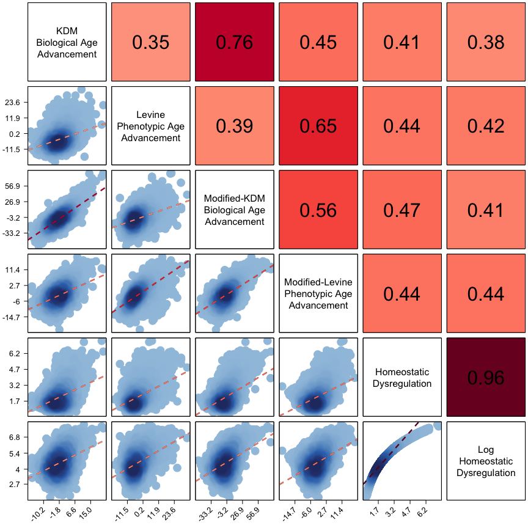

<!-- README.md is generated from README.Rmd. Please edit that file -->

# BioAge

This package measures biological aging using data from the National
Health and Nutrition Examination Survey (NHANES). The package uses
published biomarker algorithms to calculate three biological aging
measures: Klemera-Doubal Method (KDM) biological age, phenotypic age,
and homeostatic dysregulation.

## Installation (via devtools):

You can install the released version of BioAge from
(<https://github.com/dayoonkwon/BioAge>) with:

``` r
install.packages("devtools")
devtools::install_github("dayoonkwon/BioAge")
```

## Example

This serves as an example of training biologial aging measures using the
NHANES III (1988 - 1994) and projecting into NHANES IV (1999 - 2018)
dataset. It also provides documentation for fit parameters contained in
the `BioAge` package. The cleaned NHANES dataset is loaded as the
dataset `NHANES3` and `NHANES4`. The original KDM bioage and phenoage
values are saved as `kdm0` and `phenoage0` as part of NHANES dataset.

``` r
library(BioAge) #topic of example
library(dplyr)
```

## Step 1: train algorithms in NHANES III and project biological aging measures in NHANES IV

I train in the NHANES III and project biological aging measures into the
NHANES IV by using the `hd_nhanes`, `kdm_nhanes`, and `phenoage_nhanes`
function of the `BioAge` package.

``` r
#HD using NHANES (separate training for men and women)
hd = hd_nhanes(biomarkers=c("albumin","alp","lncrp","totchol","lncreat","hba1c","sbp","bun","uap","lymph","mcv","wbc"))

#KDM bioage using NHANES (separate training for men and women)
kdm = kdm_nhanes(biomarkers=c("albumin","alp","lncrp","totchol","lncreat","hba1c","sbp","bun","uap","lymph","mcv","wbc"))

#phenoage uinsg NHANES
phenoage = phenoage_nhanes(biomarkers=c("albumin_gL","alp","lncrp","totchol","lncreat_umol","hba1c","sbp","bun","uap","lymph","mcv","wbc"))
```

## Step 2: compare original KDM bioage and phenoage algorithms with algorithms composed with new biomarker set

The projected data and estimated models are saved as part of the list
structure. The dataset can be drawn by typing `data`. The model can be
drawn by typing `fit`.

``` r
#assemble NHANES IV dataset with projected biological aging measures for analysis
data = merge(hd$data, kdm$data) %>% merge(., phenoage$data)
```

### Figure1. Association of biological aging measures with chronological age in NAHNES IV dataset

In the figure below, the graphs titled “KDM Biological Age” and “Levine
Phenotypic Age” show measures based on the original biomarker sets
published in [Levine 2013 J Geron
A](https://doi.org/10.1093/gerona/gls233) and [Levine et al. 2018
AGING](https://doi.org/10.18632/aging.101414). The remaining graphs
shows the new measures computed with the biomarker set specified within
this code.

``` r
#select biological age variables
agevar = c("kdm0","phenoage0","kdm","phenoage","hd","hd_log")

#prepare labels
label = c("KDM\nBiological Age",
          "Levine\nPhenotypic Age",
          "Modified-KDM\nBiological Age",
          "Modified-Levine\nPhenotypic Age",
          "Homeostatic\nDysregulation",
          "Log\nHomeostatic\nDysregulation")

#plot age vs bioage
plot_ba(data, agevar, label)
```

<!-- -->

### Figure2. Correlations among biological aging measures

The figure plots associations among the different biological aging
measures. Cells below the diagonal show scatter plots of the measures
listed above the cell (x-axis) and to the right (y-axis). Cells above
the diagonal show the Pearson correlations for the measures listed below
the cell and to the left. For this analysis, KDM Biological Age and
Levine Phenotypic Age measures are differenced from chronological age
(i.e. plotted values = BA-CA).

``` r
#select biological age variables
agevar = c("kdm_advance0","phenoage_advance0","kdm_advance","phenoage_advance","hd","hd_log")

#prepare lables
#values should be formatted for displaying along diagonal of the plot
#names should be used to match variables and order is preserved
label = c(
  "kdm_advance0"="KDM\nBiological Age\nAdvancement",
  "phenoage_advance0"="Levine\nPhenotypic Age\nAdvancement",
  "kdm_advance"="Modified-KDM\nBiological Age\nAdvancement",
  "phenoage_advance"="Modified-Levine\nPhenotypic Age\nAdvancement",
  "hd" = "Homeostatic\nDysregulation",
  "hd_log" = "Log\nHomeostatic\nDysregulation")

#use variable name to define the axis type ("int" or "float")
axis_type = c(
  "kdm_advance0"="float",
  "phenoage_advance0"="float",
  "kdm_advance"="float",
  "phenoage_advance"="flot",
  "hd"="flot",
  "hd_log"="float")

#plot BAA corplot
plot_baa(data,agevar,label,axis_type)
```

<!-- -->

### Table 1. Associations of biological aging measures with mortality

``` r
table_surv(data, agevar, label)
```

<table class="gmisc_table" style="border-collapse: collapse; margin-top: 1em; margin-bottom: 1em;">
<thead>
<tr>
<td colspan="7" style="text-align: left;">
Table 1. Associations of biological aging measures with mortality.
BioAge coefficients in the table are hazard ratios estimated from Cox
proportional hazard regressions. KDM Biological Age and Levine
Phenotypic Age measures were differenced from chronological age for
analysis (i.e. values = BA-CA). These differenced values were then
standardized to have M=0, SD=1 separately for men and women within the
analysis sample so that effect-sizes are denominated in terms of a
sex-specific 1 SD unit increase in biological age advancement. Models
included covariates for chronological age and sex. The original KDM
Biological Age algorithm (left-most column) was projected onto data from
NHANES 2007-2010 only because other NHANES IV waves did not include
spirometry measurements. The original Levine Phenotypic Age algorithm
(second column from left) was projected onto data from NHANES 1999-2010
and 2015-2018 only because the intervening waves did not include CRP
measurements.
</td>
</tr>
<tr>
<th style="border-bottom: 1px solid grey; border-top: 2px solid grey;">
</th>
<th style="font-weight: 900; width: 300px; font-size: .83em; border-bottom: 1px solid grey; border-top: 2px solid grey; text-align: center;">
KDM Biological Age Advancement
</th>
<th style="font-weight: 900; width: 300px; font-size: .83em; border-bottom: 1px solid grey; border-top: 2px solid grey; text-align: center;">
Levine Phenotypic Age Advancement
</th>
<th style="font-weight: 900; width: 300px; font-size: .83em; border-bottom: 1px solid grey; border-top: 2px solid grey; text-align: center;">
Modified-KDM Biological Age Advancement
</th>
<th style="font-weight: 900; width: 300px; font-size: .83em; border-bottom: 1px solid grey; border-top: 2px solid grey; text-align: center;">
Modified-Levine Phenotypic Age Advancement
</th>
<th style="font-weight: 900; width: 300px; font-size: .83em; border-bottom: 1px solid grey; border-top: 2px solid grey; text-align: center;">
Homeostatic Dysregulation
</th>
<th style="font-weight: 900; width: 300px; font-size: .83em; border-bottom: 1px solid grey; border-top: 2px solid grey; text-align: center;">
Log Homeostatic Dysregulation
</th>
</tr>
</thead>
<tbody>
<tr>
<td colspan="7" style="width: 300px; font-size: .83em; font-weight: 900; text-align: center;">
Hazard Ratio (95% CI)
</td>
</tr>
<tr>
<td colspan="7" style="width: 300px; font-size: .83em; font-weight: 900; text-align: left;">
Full Sample
</td>
</tr>
<tr>
<td style="width: 300px; font-size: .83em; text-align: left;">
  n
</td>
<td style="width: 300px; font-size: .83em; text-align: left;">
8234
</td>
<td style="width: 300px; font-size: .83em; text-align: left;">
27837
</td>
<td style="width: 300px; font-size: .83em; text-align: left;">
26580
</td>
<td style="width: 300px; font-size: .83em; text-align: left;">
26580
</td>
<td style="width: 300px; font-size: .83em; text-align: left;">
26580
</td>
<td style="width: 300px; font-size: .83em; text-align: left;">
26580
</td>
</tr>
<tr>
<td style="width: 300px; font-size: .83em; text-align: left;">
  BioAge
</td>
<td style="width: 300px; font-size: .83em; text-align: left;">
1.36 (1.2, 1.55)
</td>
<td style="width: 300px; font-size: .83em; text-align: left;">
1.47 (1.42, 1.51)
</td>
<td style="width: 300px; font-size: .83em; text-align: left;">
1.26 (1.22, 1.31)
</td>
<td style="width: 300px; font-size: .83em; text-align: left;">
1.43 (1.37, 1.49)
</td>
<td style="width: 300px; font-size: .83em; text-align: left;">
1.35 (1.3, 1.4)
</td>
<td style="width: 300px; font-size: .83em; text-align: left;">
1.44 (1.38, 1.51)
</td>
</tr>
<tr>
<td colspan="7" style="width: 300px; font-size: .83em; font-weight: 900; text-align: center; border-top: 1px solid #BEBEBE;">
Stratified by Gender
</td>
</tr>
<tr>
<td colspan="7" style="width: 300px; font-size: .83em; font-weight: 900; text-align: left;">
Men
</td>
</tr>
<tr>
<td style="width: 300px; font-size: .83em; text-align: left;">
  n
</td>
<td style="width: 300px; font-size: .83em; text-align: left;">
4114
</td>
<td style="width: 300px; font-size: .83em; text-align: left;">
13421
</td>
<td style="width: 300px; font-size: .83em; text-align: left;">
12879
</td>
<td style="width: 300px; font-size: .83em; text-align: left;">
12879
</td>
<td style="width: 300px; font-size: .83em; text-align: left;">
12879
</td>
<td style="width: 300px; font-size: .83em; text-align: left;">
12879
</td>
</tr>
<tr>
<td style="width: 300px; font-size: .83em; text-align: left;">
  BioAge
</td>
<td style="width: 300px; font-size: .83em; text-align: left;">
1.44 (1.23, 1.69)
</td>
<td style="width: 300px; font-size: .83em; text-align: left;">
1.44 (1.38, 1.5)
</td>
<td style="width: 300px; font-size: .83em; text-align: left;">
1.28 (1.22, 1.34)
</td>
<td style="width: 300px; font-size: .83em; text-align: left;">
1.41 (1.34, 1.49)
</td>
<td style="width: 300px; font-size: .83em; text-align: left;">
1.32 (1.26, 1.38)
</td>
<td style="width: 300px; font-size: .83em; text-align: left;">
1.4 (1.32, 1.49)
</td>
</tr>
<tr>
<td colspan="7" style="width: 300px; font-size: .83em; font-weight: 900; text-align: left;">
Women
</td>
</tr>
<tr>
<td style="width: 300px; font-size: .83em; text-align: left;">
  n
</td>
<td style="width: 300px; font-size: .83em; text-align: left;">
4120
</td>
<td style="width: 300px; font-size: .83em; text-align: left;">
14416
</td>
<td style="width: 300px; font-size: .83em; text-align: left;">
13701
</td>
<td style="width: 300px; font-size: .83em; text-align: left;">
13701
</td>
<td style="width: 300px; font-size: .83em; text-align: left;">
13701
</td>
<td style="width: 300px; font-size: .83em; text-align: left;">
13701
</td>
</tr>
<tr>
<td style="width: 300px; font-size: .83em; text-align: left;">
  BioAge
</td>
<td style="width: 300px; font-size: .83em; text-align: left;">
1.23 (0.98, 1.54)
</td>
<td style="width: 300px; font-size: .83em; text-align: left;">
1.52 (1.45, 1.6)
</td>
<td style="width: 300px; font-size: .83em; text-align: left;">
1.24 (1.18, 1.31)
</td>
<td style="width: 300px; font-size: .83em; text-align: left;">
1.46 (1.37, 1.55)
</td>
<td style="width: 300px; font-size: .83em; text-align: left;">
1.39 (1.32, 1.48)
</td>
<td style="width: 300px; font-size: .83em; text-align: left;">
1.53 (1.41, 1.66)
</td>
</tr>
<tr>
<td colspan="7" style="width: 300px; font-size: .83em; font-weight: 900; text-align: center; border-top: 1px solid #BEBEBE;">
Stratified by Race
</td>
</tr>
<tr>
<td colspan="7" style="width: 300px; font-size: .83em; font-weight: 900; text-align: left;">
White
</td>
</tr>
<tr>
<td style="width: 300px; font-size: .83em; text-align: left;">
  n
</td>
<td style="width: 300px; font-size: .83em; text-align: left;">
3937
</td>
<td style="width: 300px; font-size: .83em; text-align: left;">
13958
</td>
<td style="width: 300px; font-size: .83em; text-align: left;">
13447
</td>
<td style="width: 300px; font-size: .83em; text-align: left;">
13447
</td>
<td style="width: 300px; font-size: .83em; text-align: left;">
13447
</td>
<td style="width: 300px; font-size: .83em; text-align: left;">
13447
</td>
</tr>
<tr>
<td style="width: 300px; font-size: .83em; text-align: left;">
  BioAge
</td>
<td style="width: 300px; font-size: .83em; text-align: left;">
1.44 (1.21, 1.72)
</td>
<td style="width: 300px; font-size: .83em; text-align: left;">
1.54 (1.47, 1.6)
</td>
<td style="width: 300px; font-size: .83em; text-align: left;">
1.28 (1.22, 1.34)
</td>
<td style="width: 300px; font-size: .83em; text-align: left;">
1.49 (1.42, 1.58)
</td>
<td style="width: 300px; font-size: .83em; text-align: left;">
1.42 (1.35, 1.49)
</td>
<td style="width: 300px; font-size: .83em; text-align: left;">
1.52 (1.43, 1.63)
</td>
</tr>
<tr>
<td colspan="7" style="width: 300px; font-size: .83em; font-weight: 900; text-align: left;">
Black
</td>
</tr>
<tr>
<td style="width: 300px; font-size: .83em; text-align: left;">
  n
</td>
<td style="width: 300px; font-size: .83em; text-align: left;">
1467
</td>
<td style="width: 300px; font-size: .83em; text-align: left;">
5176
</td>
<td style="width: 300px; font-size: .83em; text-align: left;">
4851
</td>
<td style="width: 300px; font-size: .83em; text-align: left;">
4851
</td>
<td style="width: 300px; font-size: .83em; text-align: left;">
4851
</td>
<td style="width: 300px; font-size: .83em; text-align: left;">
4851
</td>
</tr>
<tr>
<td style="width: 300px; font-size: .83em; text-align: left;">
  BioAge
</td>
<td style="width: 300px; font-size: .83em; text-align: left;">
1.51 (1.15, 1.99)
</td>
<td style="width: 300px; font-size: .83em; text-align: left;">
1.37 (1.28, 1.47)
</td>
<td style="width: 300px; font-size: .83em; text-align: left;">
1.26 (1.17, 1.35)
</td>
<td style="width: 300px; font-size: .83em; text-align: left;">
1.36 (1.26, 1.48)
</td>
<td style="width: 300px; font-size: .83em; text-align: left;">
1.33 (1.23, 1.43)
</td>
<td style="width: 300px; font-size: .83em; text-align: left;">
1.47 (1.31, 1.64)
</td>
</tr>
<tr>
<td colspan="7" style="width: 300px; font-size: .83em; font-weight: 900; text-align: left;">
Other
</td>
</tr>
<tr>
<td style="width: 300px; font-size: .83em; text-align: left;">
  n
</td>
<td style="width: 300px; font-size: .83em; text-align: left;">
2830
</td>
<td style="width: 300px; font-size: .83em; text-align: left;">
8703
</td>
<td style="width: 300px; font-size: .83em; text-align: left;">
8282
</td>
<td style="width: 300px; font-size: .83em; text-align: left;">
8282
</td>
<td style="width: 300px; font-size: .83em; text-align: left;">
8282
</td>
<td style="width: 300px; font-size: .83em; text-align: left;">
8282
</td>
</tr>
<tr>
<td style="width: 300px; font-size: .83em; text-align: left;">
  BioAge
</td>
<td style="width: 300px; font-size: .83em; text-align: left;">
1.21 (0.89, 1.65)
</td>
<td style="width: 300px; font-size: .83em; text-align: left;">
1.37 (1.28, 1.48)
</td>
<td style="width: 300px; font-size: .83em; text-align: left;">
1.19 (1.1, 1.29)
</td>
<td style="width: 300px; font-size: .83em; text-align: left;">
1.3 (1.19, 1.42)
</td>
<td style="width: 300px; font-size: .83em; text-align: left;">
1.23 (1.14, 1.33)
</td>
<td style="width: 300px; font-size: .83em; text-align: left;">
1.27 (1.15, 1.4)
</td>
</tr>
<tr>
<td colspan="7" style="width: 300px; font-size: .83em; font-weight: 900; text-align: center; border-top: 1px solid #BEBEBE;">
People Aged 65 and Younger
</td>
</tr>
<tr>
<td colspan="7" style="width: 300px; font-size: .83em; font-weight: 900; text-align: left;">
Aged 65 and Younger
</td>
</tr>
<tr>
<td style="width: 300px; font-size: .83em; text-align: left;">
  n
</td>
<td style="width: 300px; font-size: .83em; text-align: left;">
6915
</td>
<td style="width: 300px; font-size: .83em; text-align: left;">
21252
</td>
<td style="width: 300px; font-size: .83em; text-align: left;">
20344
</td>
<td style="width: 300px; font-size: .83em; text-align: left;">
20344
</td>
<td style="width: 300px; font-size: .83em; text-align: left;">
20344
</td>
<td style="width: 300px; font-size: .83em; text-align: left;">
20344
</td>
</tr>
<tr>
<td style="width: 300px; font-size: .83em; border-bottom: 2px solid grey; text-align: left;">
  BioAge
</td>
<td style="width: 300px; font-size: .83em; border-bottom: 2px solid grey; text-align: left;">
1.27 (1.06, 1.53)
</td>
<td style="width: 300px; font-size: .83em; border-bottom: 2px solid grey; text-align: left;">
1.61 (1.52, 1.7)
</td>
<td style="width: 300px; font-size: .83em; border-bottom: 2px solid grey; text-align: left;">
1.34 (1.25, 1.44)
</td>
<td style="width: 300px; font-size: .83em; border-bottom: 2px solid grey; text-align: left;">
1.51 (1.41, 1.61)
</td>
<td style="width: 300px; font-size: .83em; border-bottom: 2px solid grey; text-align: left;">
1.45 (1.36, 1.54)
</td>
<td style="width: 300px; font-size: .83em; border-bottom: 2px solid grey; text-align: left;">
1.54 (1.42, 1.67)
</td>
</tr>
</tbody>
</table>

### Table 2. Associations of biological aging measures with healthspan-related characteristics

The linear regression models and sample sizes in “Table 2” and “Table 3”
below are saved as part of the list structure. Regression model can be
drawn by typing `table`. Sample size can be drawn by typing `n`.

``` r
table2 = table_health(data,agevar,outcome = c("health","adl","lnwalk","grip_scaled"), label)

#pull table
table2$table
```

<table class="gmisc_table" style="border-collapse: collapse; margin-top: 1em; margin-bottom: 1em;">
<thead>
<tr>
<td colspan="7" style="text-align: left;">
Table 2. Associations of biological aging measures with
healthspan-related characteristics. Coefficients are from linear
regressions of healthspan-related characteristics on biological aging
measures. Outcome variables were standardized to have M=0, SD=1 for
analysis. Standardization was performed separately for men and women in
the case of grip strength. Walk speed was log transformed prior to
standardization to reduce skew. KDM Biological Age and Levine Phenotypic
Age measures were differenced from chronological age for analysis
(i.e. values = BA-CA). These differenced values were then standardized
to have M=0, SD=1 separately for men and women within the analysis
sample so that effect-sizes are denominated in terms of a sex-specific 1
SD unit increase in biological age advancement. Models included
covariates for chronological age and sex. The original KDM Biological
Age algorithm (left-most column) was projected onto data from NHANES
2007-2010 only because other NHANES IV waves did not include spirometry
measurements. The original Levine Phenotypic Age algorithm (second
column from left) was projected onto data from NHANES 1999-2010 and
2015-2018 only because the intervening waves did not include CRP
measurements. Walk speed was measured only in NHANES 1999-2002 and is
available only for participants aged 50 and older. Grip strength was
measured only in NHANES 2011-2014.
</td>
</tr>
<tr>
<th style="border-bottom: 1px solid grey; border-top: 2px solid grey;">
</th>
<th style="font-weight: 900; width: 600px; font-size: 0.77em; border-bottom: 1px solid grey; border-top: 2px solid grey; text-align: center;">
KDM Biological Age Advancement
</th>
<th style="font-weight: 900; width: 600px; font-size: 0.77em; border-bottom: 1px solid grey; border-top: 2px solid grey; text-align: center;">
Levine Phenotypic Age Advancement
</th>
<th style="font-weight: 900; width: 600px; font-size: 0.77em; border-bottom: 1px solid grey; border-top: 2px solid grey; text-align: center;">
Modified-KDM Biological Age Advancement
</th>
<th style="font-weight: 900; width: 600px; font-size: 0.77em; border-bottom: 1px solid grey; border-top: 2px solid grey; text-align: center;">
Modified-Levine Phenotypic Age Advancement
</th>
<th style="font-weight: 900; width: 600px; font-size: 0.77em; border-bottom: 1px solid grey; border-top: 2px solid grey; text-align: center;">
Homeostatic Dysregulation
</th>
<th style="font-weight: 900; width: 600px; font-size: 0.77em; border-bottom: 1px solid grey; border-top: 2px solid grey; text-align: center;">
Log Homeostatic Dysregulation
</th>
</tr>
</thead>
<tbody>
<tr>
<td colspan="7" style="width: 600px; font-size: 0.77em; font-weight: 900; text-align: center;">
b (95% CI)
</td>
</tr>
<tr>
<td colspan="7" style="width: 600px; font-size: 0.77em; font-weight: 900; text-align: left;">
Full Sample
</td>
</tr>
<tr>
<td style="width: 600px; font-size: 0.77em; text-align: left;">
  health
</td>
<td style="width: 600px; font-size: 0.77em; text-align: left;">
0.25 (0.23, 0.27)
</td>
<td style="width: 600px; font-size: 0.77em; text-align: left;">
0.21 (0.2, 0.22)
</td>
<td style="width: 600px; font-size: 0.77em; text-align: left;">
0.15 (0.14, 0.16)
</td>
<td style="width: 600px; font-size: 0.77em; text-align: left;">
0.18 (0.17, 0.19)
</td>
<td style="width: 600px; font-size: 0.77em; text-align: left;">
0.23 (0.21, 0.24)
</td>
<td style="width: 600px; font-size: 0.77em; text-align: left;">
0.23 (0.22, 0.24)
</td>
</tr>
<tr>
<td style="width: 600px; font-size: 0.77em; text-align: left;">
  adl
</td>
<td style="width: 600px; font-size: 0.77em; text-align: left;">
0.13 (0.1, 0.16)
</td>
<td style="width: 600px; font-size: 0.77em; text-align: left;">
0.17 (0.15, 0.19)
</td>
<td style="width: 600px; font-size: 0.77em; text-align: left;">
0.09 (0.08, 0.11)
</td>
<td style="width: 600px; font-size: 0.77em; text-align: left;">
0.14 (0.13, 0.16)
</td>
<td style="width: 600px; font-size: 0.77em; text-align: left;">
0.11 (0.1, 0.13)
</td>
<td style="width: 600px; font-size: 0.77em; text-align: left;">
0.12 (0.11, 0.14)
</td>
</tr>
<tr>
<td style="width: 600px; font-size: 0.77em; text-align: left;">
  lnwalk
</td>
<td style="width: 600px; font-size: 0.77em; text-align: left;">
\-
</td>
<td style="width: 600px; font-size: 0.77em; text-align: left;">
0.21 (0.18, 0.24)
</td>
<td style="width: 600px; font-size: 0.77em; text-align: left;">
0.1 (0.07, 0.12)
</td>
<td style="width: 600px; font-size: 0.77em; text-align: left;">
0.15 (0.12, 0.18)
</td>
<td style="width: 600px; font-size: 0.77em; text-align: left;">
0.15 (0.12, 0.18)
</td>
<td style="width: 600px; font-size: 0.77em; text-align: left;">
0.17 (0.14, 0.2)
</td>
</tr>
<tr>
<td style="width: 600px; font-size: 0.77em; text-align: left;">
  grip\_scaled
</td>
<td style="width: 600px; font-size: 0.77em; text-align: left;">
\-
</td>
<td style="width: 600px; font-size: 0.77em; text-align: left;">
\-
</td>
<td style="width: 600px; font-size: 0.77em; text-align: left;">
\-
</td>
<td style="width: 600px; font-size: 0.77em; text-align: left;">
\-
</td>
<td style="width: 600px; font-size: 0.77em; text-align: left;">
\-
</td>
<td style="width: 600px; font-size: 0.77em; text-align: left;">
\-
</td>
</tr>
<tr>
<td colspan="7" style="width: 600px; font-size: 0.77em; font-weight: 900; text-align: center; border-top: 1px solid #BEBEBE;">
Stratified by Gender
</td>
</tr>
<tr>
<td colspan="7" style="width: 600px; font-size: 0.77em; font-weight: 900; text-align: left;">
Men
</td>
</tr>
<tr>
<td style="width: 600px; font-size: 0.77em; text-align: left;">
  health
</td>
<td style="width: 600px; font-size: 0.77em; text-align: left;">
0.23 (0.2, 0.26)
</td>
<td style="width: 600px; font-size: 0.77em; text-align: left;">
0.22 (0.2, 0.23)
</td>
<td style="width: 600px; font-size: 0.77em; text-align: left;">
0.17 (0.15, 0.18)
</td>
<td style="width: 600px; font-size: 0.77em; text-align: left;">
0.18 (0.17, 0.2)
</td>
<td style="width: 600px; font-size: 0.77em; text-align: left;">
0.21 (0.2, 0.23)
</td>
<td style="width: 600px; font-size: 0.77em; text-align: left;">
0.22 (0.2, 0.24)
</td>
</tr>
<tr>
<td style="width: 600px; font-size: 0.77em; text-align: left;">
  adl
</td>
<td style="width: 600px; font-size: 0.77em; text-align: left;">
0.12 (0.08, 0.15)
</td>
<td style="width: 600px; font-size: 0.77em; text-align: left;">
0.15 (0.13, 0.17)
</td>
<td style="width: 600px; font-size: 0.77em; text-align: left;">
0.1 (0.08, 0.12)
</td>
<td style="width: 600px; font-size: 0.77em; text-align: left;">
0.12 (0.1, 0.14)
</td>
<td style="width: 600px; font-size: 0.77em; text-align: left;">
0.09 (0.07, 0.11)
</td>
<td style="width: 600px; font-size: 0.77em; text-align: left;">
0.1 (0.08, 0.13)
</td>
</tr>
<tr>
<td style="width: 600px; font-size: 0.77em; text-align: left;">
  lnwalk
</td>
<td style="width: 600px; font-size: 0.77em; text-align: left;">
\-
</td>
<td style="width: 600px; font-size: 0.77em; text-align: left;">
0.16 (0.12, 0.2)
</td>
<td style="width: 600px; font-size: 0.77em; text-align: left;">
0.08 (0.05, 0.12)
</td>
<td style="width: 600px; font-size: 0.77em; text-align: left;">
0.11 (0.07, 0.14)
</td>
<td style="width: 600px; font-size: 0.77em; text-align: left;">
0.12 (0.08, 0.15)
</td>
<td style="width: 600px; font-size: 0.77em; text-align: left;">
0.14 (0.1, 0.18)
</td>
</tr>
<tr>
<td style="width: 600px; font-size: 0.77em; text-align: left;">
  grip\_scaled
</td>
<td style="width: 600px; font-size: 0.77em; text-align: left;">
\-
</td>
<td style="width: 600px; font-size: 0.77em; text-align: left;">
\-
</td>
<td style="width: 600px; font-size: 0.77em; text-align: left;">
\-
</td>
<td style="width: 600px; font-size: 0.77em; text-align: left;">
\-
</td>
<td style="width: 600px; font-size: 0.77em; text-align: left;">
\-
</td>
<td style="width: 600px; font-size: 0.77em; text-align: left;">
\-
</td>
</tr>
<tr>
<td colspan="7" style="width: 600px; font-size: 0.77em; font-weight: 900; text-align: left;">
Women
</td>
</tr>
<tr>
<td style="width: 600px; font-size: 0.77em; text-align: left;">
  health
</td>
<td style="width: 600px; font-size: 0.77em; text-align: left;">
0.28 (0.25, 0.31)
</td>
<td style="width: 600px; font-size: 0.77em; text-align: left;">
0.22 (0.2, 0.23)
</td>
<td style="width: 600px; font-size: 0.77em; text-align: left;">
0.14 (0.12, 0.15)
</td>
<td style="width: 600px; font-size: 0.77em; text-align: left;">
0.17 (0.15, 0.19)
</td>
<td style="width: 600px; font-size: 0.77em; text-align: left;">
0.24 (0.22, 0.26)
</td>
<td style="width: 600px; font-size: 0.77em; text-align: left;">
0.24 (0.23, 0.26)
</td>
</tr>
<tr>
<td style="width: 600px; font-size: 0.77em; text-align: left;">
  adl
</td>
<td style="width: 600px; font-size: 0.77em; text-align: left;">
0.14 (0.09, 0.19)
</td>
<td style="width: 600px; font-size: 0.77em; text-align: left;">
0.19 (0.17, 0.22)
</td>
<td style="width: 600px; font-size: 0.77em; text-align: left;">
0.08 (0.06, 0.11)
</td>
<td style="width: 600px; font-size: 0.77em; text-align: left;">
0.16 (0.14, 0.19)
</td>
<td style="width: 600px; font-size: 0.77em; text-align: left;">
0.14 (0.12, 0.17)
</td>
<td style="width: 600px; font-size: 0.77em; text-align: left;">
0.16 (0.13, 0.19)
</td>
</tr>
<tr>
<td style="width: 600px; font-size: 0.77em; text-align: left;">
  lnwalk
</td>
<td style="width: 600px; font-size: 0.77em; text-align: left;">
\-
</td>
<td style="width: 600px; font-size: 0.77em; text-align: left;">
0.27 (0.22, 0.31)
</td>
<td style="width: 600px; font-size: 0.77em; text-align: left;">
0.11 (0.07, 0.15)
</td>
<td style="width: 600px; font-size: 0.77em; text-align: left;">
0.19 (0.14, 0.23)
</td>
<td style="width: 600px; font-size: 0.77em; text-align: left;">
0.18 (0.13, 0.22)
</td>
<td style="width: 600px; font-size: 0.77em; text-align: left;">
0.21 (0.16, 0.26)
</td>
</tr>
<tr>
<td style="width: 600px; font-size: 0.77em; text-align: left;">
  grip\_scaled
</td>
<td style="width: 600px; font-size: 0.77em; text-align: left;">
\-
</td>
<td style="width: 600px; font-size: 0.77em; text-align: left;">
\-
</td>
<td style="width: 600px; font-size: 0.77em; text-align: left;">
\-
</td>
<td style="width: 600px; font-size: 0.77em; text-align: left;">
\-
</td>
<td style="width: 600px; font-size: 0.77em; text-align: left;">
\-
</td>
<td style="width: 600px; font-size: 0.77em; text-align: left;">
\-
</td>
</tr>
<tr>
<td colspan="7" style="width: 600px; font-size: 0.77em; font-weight: 900; text-align: center; border-top: 1px solid #BEBEBE;">
Stratified by Race
</td>
</tr>
<tr>
<td colspan="7" style="width: 600px; font-size: 0.77em; font-weight: 900; text-align: left;">
White
</td>
</tr>
<tr>
<td style="width: 600px; font-size: 0.77em; text-align: left;">
  health
</td>
<td style="width: 600px; font-size: 0.77em; text-align: left;">
0.3 (0.27, 0.33)
</td>
<td style="width: 600px; font-size: 0.77em; text-align: left;">
0.27 (0.25, 0.28)
</td>
<td style="width: 600px; font-size: 0.77em; text-align: left;">
0.17 (0.15, 0.18)
</td>
<td style="width: 600px; font-size: 0.77em; text-align: left;">
0.25 (0.23, 0.26)
</td>
<td style="width: 600px; font-size: 0.77em; text-align: left;">
0.24 (0.23, 0.26)
</td>
<td style="width: 600px; font-size: 0.77em; text-align: left;">
0.24 (0.23, 0.26)
</td>
</tr>
<tr>
<td style="width: 600px; font-size: 0.77em; text-align: left;">
  adl
</td>
<td style="width: 600px; font-size: 0.77em; text-align: left;">
0.15 (0.11, 0.19)
</td>
<td style="width: 600px; font-size: 0.77em; text-align: left;">
0.2 (0.18, 0.22)
</td>
<td style="width: 600px; font-size: 0.77em; text-align: left;">
0.1 (0.08, 0.12)
</td>
<td style="width: 600px; font-size: 0.77em; text-align: left;">
0.17 (0.15, 0.19)
</td>
<td style="width: 600px; font-size: 0.77em; text-align: left;">
0.13 (0.11, 0.15)
</td>
<td style="width: 600px; font-size: 0.77em; text-align: left;">
0.13 (0.11, 0.16)
</td>
</tr>
<tr>
<td style="width: 600px; font-size: 0.77em; text-align: left;">
  lnwalk
</td>
<td style="width: 600px; font-size: 0.77em; text-align: left;">
\-
</td>
<td style="width: 600px; font-size: 0.77em; text-align: left;">
0.25 (0.21, 0.28)
</td>
<td style="width: 600px; font-size: 0.77em; text-align: left;">
0.12 (0.09, 0.15)
</td>
<td style="width: 600px; font-size: 0.77em; text-align: left;">
0.18 (0.15, 0.22)
</td>
<td style="width: 600px; font-size: 0.77em; text-align: left;">
0.15 (0.11, 0.19)
</td>
<td style="width: 600px; font-size: 0.77em; text-align: left;">
0.16 (0.12, 0.2)
</td>
</tr>
<tr>
<td style="width: 600px; font-size: 0.77em; text-align: left;">
  grip\_scaled
</td>
<td style="width: 600px; font-size: 0.77em; text-align: left;">
\-
</td>
<td style="width: 600px; font-size: 0.77em; text-align: left;">
\-
</td>
<td style="width: 600px; font-size: 0.77em; text-align: left;">
\-
</td>
<td style="width: 600px; font-size: 0.77em; text-align: left;">
\-
</td>
<td style="width: 600px; font-size: 0.77em; text-align: left;">
\-
</td>
<td style="width: 600px; font-size: 0.77em; text-align: left;">
\-
</td>
</tr>
<tr>
<td colspan="7" style="width: 600px; font-size: 0.77em; font-weight: 900; text-align: left;">
Black
</td>
</tr>
<tr>
<td style="width: 600px; font-size: 0.77em; text-align: left;">
  health
</td>
<td style="width: 600px; font-size: 0.77em; text-align: left;">
0.18 (0.13, 0.22)
</td>
<td style="width: 600px; font-size: 0.77em; text-align: left;">
0.17 (0.14, 0.19)
</td>
<td style="width: 600px; font-size: 0.77em; text-align: left;">
0.15 (0.13, 0.18)
</td>
<td style="width: 600px; font-size: 0.77em; text-align: left;">
0.16 (0.14, 0.18)
</td>
<td style="width: 600px; font-size: 0.77em; text-align: left;">
0.2 (0.17, 0.22)
</td>
<td style="width: 600px; font-size: 0.77em; text-align: left;">
0.21 (0.18, 0.24)
</td>
</tr>
<tr>
<td style="width: 600px; font-size: 0.77em; text-align: left;">
  adl
</td>
<td style="width: 600px; font-size: 0.77em; text-align: left;">
0.08 (0, 0.16)
</td>
<td style="width: 600px; font-size: 0.77em; text-align: left;">
0.13 (0.1, 0.17)
</td>
<td style="width: 600px; font-size: 0.77em; text-align: left;">
0.08 (0.05, 0.12)
</td>
<td style="width: 600px; font-size: 0.77em; text-align: left;">
0.11 (0.08, 0.15)
</td>
<td style="width: 600px; font-size: 0.77em; text-align: left;">
0.11 (0.07, 0.15)
</td>
<td style="width: 600px; font-size: 0.77em; text-align: left;">
0.12 (0.07, 0.17)
</td>
</tr>
<tr>
<td style="width: 600px; font-size: 0.77em; text-align: left;">
  lnwalk
</td>
<td style="width: 600px; font-size: 0.77em; text-align: left;">
\-
</td>
<td style="width: 600px; font-size: 0.77em; text-align: left;">
0.14 (0.07, 0.21)
</td>
<td style="width: 600px; font-size: 0.77em; text-align: left;">
0.03 (-0.03, 0.1)
</td>
<td style="width: 600px; font-size: 0.77em; text-align: left;">
0.1 (0.03, 0.17)
</td>
<td style="width: 600px; font-size: 0.77em; text-align: left;">
0.08 (0.01, 0.15)
</td>
<td style="width: 600px; font-size: 0.77em; text-align: left;">
0.11 (0.02, 0.2)
</td>
</tr>
<tr>
<td style="width: 600px; font-size: 0.77em; text-align: left;">
  grip\_scaled
</td>
<td style="width: 600px; font-size: 0.77em; text-align: left;">
\-
</td>
<td style="width: 600px; font-size: 0.77em; text-align: left;">
\-
</td>
<td style="width: 600px; font-size: 0.77em; text-align: left;">
\-
</td>
<td style="width: 600px; font-size: 0.77em; text-align: left;">
\-
</td>
<td style="width: 600px; font-size: 0.77em; text-align: left;">
\-
</td>
<td style="width: 600px; font-size: 0.77em; text-align: left;">
\-
</td>
</tr>
<tr>
<td colspan="7" style="width: 600px; font-size: 0.77em; font-weight: 900; text-align: left;">
Other
</td>
</tr>
<tr>
<td style="width: 600px; font-size: 0.77em; text-align: left;">
  health
</td>
<td style="width: 600px; font-size: 0.77em; text-align: left;">
0.15 (0.11, 0.19)
</td>
<td style="width: 600px; font-size: 0.77em; text-align: left;">
0.15 (0.13, 0.17)
</td>
<td style="width: 600px; font-size: 0.77em; text-align: left;">
0.11 (0.09, 0.13)
</td>
<td style="width: 600px; font-size: 0.77em; text-align: left;">
0.13 (0.11, 0.15)
</td>
<td style="width: 600px; font-size: 0.77em; text-align: left;">
0.17 (0.15, 0.19)
</td>
<td style="width: 600px; font-size: 0.77em; text-align: left;">
0.17 (0.15, 0.19)
</td>
</tr>
<tr>
<td style="width: 600px; font-size: 0.77em; text-align: left;">
  adl
</td>
<td style="width: 600px; font-size: 0.77em; text-align: left;">
0.15 (0.09, 0.21)
</td>
<td style="width: 600px; font-size: 0.77em; text-align: left;">
0.15 (0.12, 0.18)
</td>
<td style="width: 600px; font-size: 0.77em; text-align: left;">
0.09 (0.06, 0.12)
</td>
<td style="width: 600px; font-size: 0.77em; text-align: left;">
0.12 (0.09, 0.15)
</td>
<td style="width: 600px; font-size: 0.77em; text-align: left;">
0.1 (0.07, 0.13)
</td>
<td style="width: 600px; font-size: 0.77em; text-align: left;">
0.12 (0.08, 0.15)
</td>
</tr>
<tr>
<td style="width: 600px; font-size: 0.77em; text-align: left;">
  lnwalk
</td>
<td style="width: 600px; font-size: 0.77em; text-align: left;">
\-
</td>
<td style="width: 600px; font-size: 0.77em; text-align: left;">
0.15 (0.09, 0.21)
</td>
<td style="width: 600px; font-size: 0.77em; text-align: left;">
0.01 (-0.04, 0.07)
</td>
<td style="width: 600px; font-size: 0.77em; text-align: left;">
0.08 (0.03, 0.14)
</td>
<td style="width: 600px; font-size: 0.77em; text-align: left;">
0.06 (0.01, 0.11)
</td>
<td style="width: 600px; font-size: 0.77em; text-align: left;">
0.07 (0.01, 0.14)
</td>
</tr>
<tr>
<td style="width: 600px; font-size: 0.77em; text-align: left;">
  grip\_scaled
</td>
<td style="width: 600px; font-size: 0.77em; text-align: left;">
\-
</td>
<td style="width: 600px; font-size: 0.77em; text-align: left;">
\-
</td>
<td style="width: 600px; font-size: 0.77em; text-align: left;">
\-
</td>
<td style="width: 600px; font-size: 0.77em; text-align: left;">
\-
</td>
<td style="width: 600px; font-size: 0.77em; text-align: left;">
\-
</td>
<td style="width: 600px; font-size: 0.77em; text-align: left;">
\-
</td>
</tr>
<tr>
<td colspan="7" style="width: 600px; font-size: 0.77em; font-weight: 900; text-align: center; border-top: 1px solid #BEBEBE;">
Stratified by Age
</td>
</tr>
<tr>
<td colspan="7" style="width: 600px; font-size: 0.77em; font-weight: 900; text-align: left;">
Age 20-40
</td>
</tr>
<tr>
<td style="width: 600px; font-size: 0.77em; text-align: left;">
  health
</td>
<td style="width: 600px; font-size: 0.77em; text-align: left;">
0.21 (0.17, 0.25)
</td>
<td style="width: 600px; font-size: 0.77em; text-align: left;">
0.19 (0.17, 0.21)
</td>
<td style="width: 600px; font-size: 0.77em; text-align: left;">
0.15 (0.12, 0.17)
</td>
<td style="width: 600px; font-size: 0.77em; text-align: left;">
0.12 (0.1, 0.14)
</td>
<td style="width: 600px; font-size: 0.77em; text-align: left;">
0.19 (0.16, 0.22)
</td>
<td style="width: 600px; font-size: 0.77em; text-align: left;">
0.15 (0.13, 0.18)
</td>
</tr>
<tr>
<td style="width: 600px; font-size: 0.77em; text-align: left;">
  adl
</td>
<td style="width: 600px; font-size: 0.77em; text-align: left;">
0.02 (-0.08, 0.13)
</td>
<td style="width: 600px; font-size: 0.77em; text-align: left;">
0.11 (0.06, 0.17)
</td>
<td style="width: 600px; font-size: 0.77em; text-align: left;">
0.04 (-0.02, 0.1)
</td>
<td style="width: 600px; font-size: 0.77em; text-align: left;">
0.07 (0.02, 0.12)
</td>
<td style="width: 600px; font-size: 0.77em; text-align: left;">
0.06 (0, 0.13)
</td>
<td style="width: 600px; font-size: 0.77em; text-align: left;">
0.06 (0, 0.12)
</td>
</tr>
<tr>
<td style="width: 600px; font-size: 0.77em; text-align: left;">
  lnwalk
</td>
<td style="width: 600px; font-size: 0.77em; text-align: left;">
\-
</td>
<td style="width: 600px; font-size: 0.77em; text-align: left;">
\-
</td>
<td style="width: 600px; font-size: 0.77em; text-align: left;">
\-
</td>
<td style="width: 600px; font-size: 0.77em; text-align: left;">
\-
</td>
<td style="width: 600px; font-size: 0.77em; text-align: left;">
\-
</td>
<td style="width: 600px; font-size: 0.77em; text-align: left;">
\-
</td>
</tr>
<tr>
<td style="width: 600px; font-size: 0.77em; text-align: left;">
  grip\_scaled
</td>
<td style="width: 600px; font-size: 0.77em; text-align: left;">
\-
</td>
<td style="width: 600px; font-size: 0.77em; text-align: left;">
\-
</td>
<td style="width: 600px; font-size: 0.77em; text-align: left;">
\-
</td>
<td style="width: 600px; font-size: 0.77em; text-align: left;">
\-
</td>
<td style="width: 600px; font-size: 0.77em; text-align: left;">
\-
</td>
<td style="width: 600px; font-size: 0.77em; text-align: left;">
\-
</td>
</tr>
<tr>
<td colspan="7" style="width: 600px; font-size: 0.77em; font-weight: 900; text-align: left;">
Age 40-60
</td>
</tr>
<tr>
<td style="width: 600px; font-size: 0.77em; text-align: left;">
  health
</td>
<td style="width: 600px; font-size: 0.77em; text-align: left;">
0.28 (0.25, 0.32)
</td>
<td style="width: 600px; font-size: 0.77em; text-align: left;">
0.26 (0.24, 0.28)
</td>
<td style="width: 600px; font-size: 0.77em; text-align: left;">
0.19 (0.17, 0.21)
</td>
<td style="width: 600px; font-size: 0.77em; text-align: left;">
0.22 (0.2, 0.24)
</td>
<td style="width: 600px; font-size: 0.77em; text-align: left;">
0.28 (0.26, 0.3)
</td>
<td style="width: 600px; font-size: 0.77em; text-align: left;">
0.28 (0.26, 0.3)
</td>
</tr>
<tr>
<td style="width: 600px; font-size: 0.77em; text-align: left;">
  adl
</td>
<td style="width: 600px; font-size: 0.77em; text-align: left;">
0.18 (0.09, 0.27)
</td>
<td style="width: 600px; font-size: 0.77em; text-align: left;">
0.17 (0.12, 0.21)
</td>
<td style="width: 600px; font-size: 0.77em; text-align: left;">
0.09 (0.05, 0.14)
</td>
<td style="width: 600px; font-size: 0.77em; text-align: left;">
0.12 (0.08, 0.17)
</td>
<td style="width: 600px; font-size: 0.77em; text-align: left;">
0.15 (0.1, 0.2)
</td>
<td style="width: 600px; font-size: 0.77em; text-align: left;">
0.17 (0.12, 0.22)
</td>
</tr>
<tr>
<td style="width: 600px; font-size: 0.77em; text-align: left;">
  lnwalk
</td>
<td style="width: 600px; font-size: 0.77em; text-align: left;">
\-
</td>
<td style="width: 600px; font-size: 0.77em; text-align: left;">
0.22 (0.17, 0.27)
</td>
<td style="width: 600px; font-size: 0.77em; text-align: left;">
0.15 (0.1, 0.19)
</td>
<td style="width: 600px; font-size: 0.77em; text-align: left;">
0.17 (0.13, 0.22)
</td>
<td style="width: 600px; font-size: 0.77em; text-align: left;">
0.21 (0.17, 0.26)
</td>
<td style="width: 600px; font-size: 0.77em; text-align: left;">
0.22 (0.17, 0.26)
</td>
</tr>
<tr>
<td style="width: 600px; font-size: 0.77em; text-align: left;">
  grip\_scaled
</td>
<td style="width: 600px; font-size: 0.77em; text-align: left;">
\-
</td>
<td style="width: 600px; font-size: 0.77em; text-align: left;">
\-
</td>
<td style="width: 600px; font-size: 0.77em; text-align: left;">
\-
</td>
<td style="width: 600px; font-size: 0.77em; text-align: left;">
\-
</td>
<td style="width: 600px; font-size: 0.77em; text-align: left;">
\-
</td>
<td style="width: 600px; font-size: 0.77em; text-align: left;">
\-
</td>
</tr>
<tr>
<td colspan="7" style="width: 600px; font-size: 0.77em; font-weight: 900; text-align: left;">
Age 60-80
</td>
</tr>
<tr>
<td style="width: 600px; font-size: 0.77em; text-align: left;">
  health
</td>
<td style="width: 600px; font-size: 0.77em; text-align: left;">
0.26 (0.22, 0.3)
</td>
<td style="width: 600px; font-size: 0.77em; text-align: left;">
0.21 (0.19, 0.23)
</td>
<td style="width: 600px; font-size: 0.77em; text-align: left;">
0.14 (0.12, 0.15)
</td>
<td style="width: 600px; font-size: 0.77em; text-align: left;">
0.2 (0.18, 0.22)
</td>
<td style="width: 600px; font-size: 0.77em; text-align: left;">
0.22 (0.2, 0.24)
</td>
<td style="width: 600px; font-size: 0.77em; text-align: left;">
0.26 (0.24, 0.28)
</td>
</tr>
<tr>
<td style="width: 600px; font-size: 0.77em; text-align: left;">
  adl
</td>
<td style="width: 600px; font-size: 0.77em; text-align: left;">
0.11 (0.08, 0.15)
</td>
<td style="width: 600px; font-size: 0.77em; text-align: left;">
0.16 (0.14, 0.17)
</td>
<td style="width: 600px; font-size: 0.77em; text-align: left;">
0.09 (0.07, 0.11)
</td>
<td style="width: 600px; font-size: 0.77em; text-align: left;">
0.14 (0.12, 0.16)
</td>
<td style="width: 600px; font-size: 0.77em; text-align: left;">
0.11 (0.1, 0.13)
</td>
<td style="width: 600px; font-size: 0.77em; text-align: left;">
0.12 (0.1, 0.15)
</td>
</tr>
<tr>
<td style="width: 600px; font-size: 0.77em; text-align: left;">
  lnwalk
</td>
<td style="width: 600px; font-size: 0.77em; text-align: left;">
\-
</td>
<td style="width: 600px; font-size: 0.77em; text-align: left;">
0.21 (0.17, 0.25)
</td>
<td style="width: 600px; font-size: 0.77em; text-align: left;">
0.09 (0.06, 0.13)
</td>
<td style="width: 600px; font-size: 0.77em; text-align: left;">
0.14 (0.1, 0.18)
</td>
<td style="width: 600px; font-size: 0.77em; text-align: left;">
0.14 (0.1, 0.17)
</td>
<td style="width: 600px; font-size: 0.77em; text-align: left;">
0.16 (0.12, 0.2)
</td>
</tr>
<tr>
<td style="width: 600px; font-size: 0.77em; border-bottom: 2px solid grey; text-align: left;">
  grip\_scaled
</td>
<td style="width: 600px; font-size: 0.77em; border-bottom: 2px solid grey; text-align: left;">
\-
</td>
<td style="width: 600px; font-size: 0.77em; border-bottom: 2px solid grey; text-align: left;">
\-
</td>
<td style="width: 600px; font-size: 0.77em; border-bottom: 2px solid grey; text-align: left;">
\-
</td>
<td style="width: 600px; font-size: 0.77em; border-bottom: 2px solid grey; text-align: left;">
\-
</td>
<td style="width: 600px; font-size: 0.77em; border-bottom: 2px solid grey; text-align: left;">
\-
</td>
<td style="width: 600px; font-size: 0.77em; border-bottom: 2px solid grey; text-align: left;">
\-
</td>
</tr>
</tbody>
</table>

``` r
#pull sample sizes
table2$n
```

<table class="gmisc_table" style="border-collapse: collapse; margin-top: 1em; margin-bottom: 1em;">
<thead>
<tr>
<td colspan="7" style="text-align: left;">
Table 2.1. Sample sizes for regression in Table 2. Coefficients are from
linear regressions of healthspan-related characteristics on biological
aging measures.
</td>
</tr>
<tr>
<th style="border-bottom: 1px solid grey; border-top: 2px solid grey;">
</th>
<th style="font-weight: 900; width: 600px; font-size: 0.8em; border-bottom: 1px solid grey; border-top: 2px solid grey; text-align: center;">
KDM Biological Age Advancement
</th>
<th style="font-weight: 900; width: 600px; font-size: 0.8em; border-bottom: 1px solid grey; border-top: 2px solid grey; text-align: center;">
Levine Phenotypic Age Advancement
</th>
<th style="font-weight: 900; width: 600px; font-size: 0.8em; border-bottom: 1px solid grey; border-top: 2px solid grey; text-align: center;">
Modified-KDM Biological Age Advancement
</th>
<th style="font-weight: 900; width: 600px; font-size: 0.8em; border-bottom: 1px solid grey; border-top: 2px solid grey; text-align: center;">
Modified-Levine Phenotypic Age Advancement
</th>
<th style="font-weight: 900; width: 600px; font-size: 0.8em; border-bottom: 1px solid grey; border-top: 2px solid grey; text-align: center;">
Homeostatic Dysregulation
</th>
<th style="font-weight: 900; width: 600px; font-size: 0.8em; border-bottom: 1px solid grey; border-top: 2px solid grey; text-align: center;">
Log Homeostatic Dysregulation
</th>
</tr>
</thead>
<tbody>
<tr>
<td colspan="7" style="width: 600px; font-size: 0.8em; font-weight: 900; text-align: center;">
n
</td>
</tr>
<tr>
<td colspan="7" style="width: 600px; font-size: 0.8em; font-weight: 900; text-align: left;">
Full Sample
</td>
</tr>
<tr>
<td style="width: 600px; font-size: 0.8em; text-align: left;">
  health
</td>
<td style="width: 600px; font-size: 0.8em; text-align: left;">
7886
</td>
<td style="width: 600px; font-size: 0.8em; text-align: left;">
31077
</td>
<td style="width: 600px; font-size: 0.8em; text-align: left;">
30235
</td>
<td style="width: 600px; font-size: 0.8em; text-align: left;">
30235
</td>
<td style="width: 600px; font-size: 0.8em; text-align: left;">
30235
</td>
<td style="width: 600px; font-size: 0.8em; text-align: left;">
30235
</td>
</tr>
<tr>
<td style="width: 600px; font-size: 0.8em; text-align: left;">
  adl
</td>
<td style="width: 600px; font-size: 0.8em; text-align: left;">
2812
</td>
<td style="width: 600px; font-size: 0.8em; text-align: left;">
14005
</td>
<td style="width: 600px; font-size: 0.8em; text-align: left;">
13512
</td>
<td style="width: 600px; font-size: 0.8em; text-align: left;">
13512
</td>
<td style="width: 600px; font-size: 0.8em; text-align: left;">
13512
</td>
<td style="width: 600px; font-size: 0.8em; text-align: left;">
13512
</td>
</tr>
<tr>
<td style="width: 600px; font-size: 0.8em; text-align: left;">
  lnwalk
</td>
<td style="width: 600px; font-size: 0.8em; text-align: left;">
\-
</td>
<td style="width: 600px; font-size: 0.8em; text-align: left;">
3607
</td>
<td style="width: 600px; font-size: 0.8em; text-align: left;">
3531
</td>
<td style="width: 600px; font-size: 0.8em; text-align: left;">
3531
</td>
<td style="width: 600px; font-size: 0.8em; text-align: left;">
3531
</td>
<td style="width: 600px; font-size: 0.8em; text-align: left;">
3531
</td>
</tr>
<tr>
<td style="width: 600px; font-size: 0.8em; text-align: left;">
  grip\_scaled
</td>
<td style="width: 600px; font-size: 0.8em; text-align: left;">
\-
</td>
<td style="width: 600px; font-size: 0.8em; text-align: left;">
\-
</td>
<td style="width: 600px; font-size: 0.8em; text-align: left;">
\-
</td>
<td style="width: 600px; font-size: 0.8em; text-align: left;">
\-
</td>
<td style="width: 600px; font-size: 0.8em; text-align: left;">
\-
</td>
<td style="width: 600px; font-size: 0.8em; text-align: left;">
\-
</td>
</tr>
<tr>
<td colspan="7" style="width: 600px; font-size: 0.8em; font-weight: 900; text-align: center; border-top: 1px solid #BEBEBE;">
Stratified by Gender
</td>
</tr>
<tr>
<td colspan="7" style="width: 600px; font-size: 0.8em; font-weight: 900; text-align: left;">
Men
</td>
</tr>
<tr>
<td style="width: 600px; font-size: 0.8em; text-align: left;">
  health
</td>
<td style="width: 600px; font-size: 0.8em; text-align: left;">
3974
</td>
<td style="width: 600px; font-size: 0.8em; text-align: left;">
15213
</td>
<td style="width: 600px; font-size: 0.8em; text-align: left;">
14849
</td>
<td style="width: 600px; font-size: 0.8em; text-align: left;">
14849
</td>
<td style="width: 600px; font-size: 0.8em; text-align: left;">
14849
</td>
<td style="width: 600px; font-size: 0.8em; text-align: left;">
14849
</td>
</tr>
<tr>
<td style="width: 600px; font-size: 0.8em; text-align: left;">
  adl
</td>
<td style="width: 600px; font-size: 0.8em; text-align: left;">
1407
</td>
<td style="width: 600px; font-size: 0.8em; text-align: left;">
6921
</td>
<td style="width: 600px; font-size: 0.8em; text-align: left;">
6715
</td>
<td style="width: 600px; font-size: 0.8em; text-align: left;">
6715
</td>
<td style="width: 600px; font-size: 0.8em; text-align: left;">
6715
</td>
<td style="width: 600px; font-size: 0.8em; text-align: left;">
6715
</td>
</tr>
<tr>
<td style="width: 600px; font-size: 0.8em; text-align: left;">
  lnwalk
</td>
<td style="width: 600px; font-size: 0.8em; text-align: left;">
\-
</td>
<td style="width: 600px; font-size: 0.8em; text-align: left;">
1795
</td>
<td style="width: 600px; font-size: 0.8em; text-align: left;">
1768
</td>
<td style="width: 600px; font-size: 0.8em; text-align: left;">
1768
</td>
<td style="width: 600px; font-size: 0.8em; text-align: left;">
1768
</td>
<td style="width: 600px; font-size: 0.8em; text-align: left;">
1768
</td>
</tr>
<tr>
<td style="width: 600px; font-size: 0.8em; text-align: left;">
  grip\_scaled
</td>
<td style="width: 600px; font-size: 0.8em; text-align: left;">
\-
</td>
<td style="width: 600px; font-size: 0.8em; text-align: left;">
\-
</td>
<td style="width: 600px; font-size: 0.8em; text-align: left;">
\-
</td>
<td style="width: 600px; font-size: 0.8em; text-align: left;">
\-
</td>
<td style="width: 600px; font-size: 0.8em; text-align: left;">
\-
</td>
<td style="width: 600px; font-size: 0.8em; text-align: left;">
\-
</td>
</tr>
<tr>
<td colspan="7" style="width: 600px; font-size: 0.8em; font-weight: 900; text-align: left;">
Women
</td>
</tr>
<tr>
<td style="width: 600px; font-size: 0.8em; text-align: left;">
  health
</td>
<td style="width: 600px; font-size: 0.8em; text-align: left;">
3912
</td>
<td style="width: 600px; font-size: 0.8em; text-align: left;">
15864
</td>
<td style="width: 600px; font-size: 0.8em; text-align: left;">
15386
</td>
<td style="width: 600px; font-size: 0.8em; text-align: left;">
15386
</td>
<td style="width: 600px; font-size: 0.8em; text-align: left;">
15386
</td>
<td style="width: 600px; font-size: 0.8em; text-align: left;">
15386
</td>
</tr>
<tr>
<td style="width: 600px; font-size: 0.8em; text-align: left;">
  adl
</td>
<td style="width: 600px; font-size: 0.8em; text-align: left;">
1405
</td>
<td style="width: 600px; font-size: 0.8em; text-align: left;">
7084
</td>
<td style="width: 600px; font-size: 0.8em; text-align: left;">
6797
</td>
<td style="width: 600px; font-size: 0.8em; text-align: left;">
6797
</td>
<td style="width: 600px; font-size: 0.8em; text-align: left;">
6797
</td>
<td style="width: 600px; font-size: 0.8em; text-align: left;">
6797
</td>
</tr>
<tr>
<td style="width: 600px; font-size: 0.8em; text-align: left;">
  lnwalk
</td>
<td style="width: 600px; font-size: 0.8em; text-align: left;">
\-
</td>
<td style="width: 600px; font-size: 0.8em; text-align: left;">
1812
</td>
<td style="width: 600px; font-size: 0.8em; text-align: left;">
1763
</td>
<td style="width: 600px; font-size: 0.8em; text-align: left;">
1763
</td>
<td style="width: 600px; font-size: 0.8em; text-align: left;">
1763
</td>
<td style="width: 600px; font-size: 0.8em; text-align: left;">
1763
</td>
</tr>
<tr>
<td style="width: 600px; font-size: 0.8em; text-align: left;">
  grip\_scaled
</td>
<td style="width: 600px; font-size: 0.8em; text-align: left;">
\-
</td>
<td style="width: 600px; font-size: 0.8em; text-align: left;">
\-
</td>
<td style="width: 600px; font-size: 0.8em; text-align: left;">
\-
</td>
<td style="width: 600px; font-size: 0.8em; text-align: left;">
\-
</td>
<td style="width: 600px; font-size: 0.8em; text-align: left;">
\-
</td>
<td style="width: 600px; font-size: 0.8em; text-align: left;">
\-
</td>
</tr>
<tr>
<td colspan="7" style="width: 600px; font-size: 0.8em; font-weight: 900; text-align: center; border-top: 1px solid #BEBEBE;">
Stratified by Race
</td>
</tr>
<tr>
<td colspan="7" style="width: 600px; font-size: 0.8em; font-weight: 900; text-align: left;">
White
</td>
</tr>
<tr>
<td style="width: 600px; font-size: 0.8em; text-align: left;">
  health
</td>
<td style="width: 600px; font-size: 0.8em; text-align: left;">
3802
</td>
<td style="width: 600px; font-size: 0.8em; text-align: left;">
14634
</td>
<td style="width: 600px; font-size: 0.8em; text-align: left;">
14305
</td>
<td style="width: 600px; font-size: 0.8em; text-align: left;">
14305
</td>
<td style="width: 600px; font-size: 0.8em; text-align: left;">
14305
</td>
<td style="width: 600px; font-size: 0.8em; text-align: left;">
14305
</td>
</tr>
<tr>
<td style="width: 600px; font-size: 0.8em; text-align: left;">
  adl
</td>
<td style="width: 600px; font-size: 0.8em; text-align: left;">
1537
</td>
<td style="width: 600px; font-size: 0.8em; text-align: left;">
7464
</td>
<td style="width: 600px; font-size: 0.8em; text-align: left;">
7256
</td>
<td style="width: 600px; font-size: 0.8em; text-align: left;">
7256
</td>
<td style="width: 600px; font-size: 0.8em; text-align: left;">
7256
</td>
<td style="width: 600px; font-size: 0.8em; text-align: left;">
7256
</td>
</tr>
<tr>
<td style="width: 600px; font-size: 0.8em; text-align: left;">
  lnwalk
</td>
<td style="width: 600px; font-size: 0.8em; text-align: left;">
\-
</td>
<td style="width: 600px; font-size: 0.8em; text-align: left;">
2122
</td>
<td style="width: 600px; font-size: 0.8em; text-align: left;">
2098
</td>
<td style="width: 600px; font-size: 0.8em; text-align: left;">
2098
</td>
<td style="width: 600px; font-size: 0.8em; text-align: left;">
2098
</td>
<td style="width: 600px; font-size: 0.8em; text-align: left;">
2098
</td>
</tr>
<tr>
<td style="width: 600px; font-size: 0.8em; text-align: left;">
  grip\_scaled
</td>
<td style="width: 600px; font-size: 0.8em; text-align: left;">
\-
</td>
<td style="width: 600px; font-size: 0.8em; text-align: left;">
\-
</td>
<td style="width: 600px; font-size: 0.8em; text-align: left;">
\-
</td>
<td style="width: 600px; font-size: 0.8em; text-align: left;">
\-
</td>
<td style="width: 600px; font-size: 0.8em; text-align: left;">
\-
</td>
<td style="width: 600px; font-size: 0.8em; text-align: left;">
\-
</td>
</tr>
<tr>
<td colspan="7" style="width: 600px; font-size: 0.8em; font-weight: 900; text-align: left;">
Black
</td>
</tr>
<tr>
<td style="width: 600px; font-size: 0.8em; text-align: left;">
  health
</td>
<td style="width: 600px; font-size: 0.8em; text-align: left;">
1397
</td>
<td style="width: 600px; font-size: 0.8em; text-align: left;">
5938
</td>
<td style="width: 600px; font-size: 0.8em; text-align: left;">
5732
</td>
<td style="width: 600px; font-size: 0.8em; text-align: left;">
5732
</td>
<td style="width: 600px; font-size: 0.8em; text-align: left;">
5732
</td>
<td style="width: 600px; font-size: 0.8em; text-align: left;">
5732
</td>
</tr>
<tr>
<td style="width: 600px; font-size: 0.8em; text-align: left;">
  adl
</td>
<td style="width: 600px; font-size: 0.8em; text-align: left;">
501
</td>
<td style="width: 600px; font-size: 0.8em; text-align: left;">
2486
</td>
<td style="width: 600px; font-size: 0.8em; text-align: left;">
2356
</td>
<td style="width: 600px; font-size: 0.8em; text-align: left;">
2356
</td>
<td style="width: 600px; font-size: 0.8em; text-align: left;">
2356
</td>
<td style="width: 600px; font-size: 0.8em; text-align: left;">
2356
</td>
</tr>
<tr>
<td style="width: 600px; font-size: 0.8em; text-align: left;">
  lnwalk
</td>
<td style="width: 600px; font-size: 0.8em; text-align: left;">
\-
</td>
<td style="width: 600px; font-size: 0.8em; text-align: left;">
547
</td>
<td style="width: 600px; font-size: 0.8em; text-align: left;">
525
</td>
<td style="width: 600px; font-size: 0.8em; text-align: left;">
525
</td>
<td style="width: 600px; font-size: 0.8em; text-align: left;">
525
</td>
<td style="width: 600px; font-size: 0.8em; text-align: left;">
525
</td>
</tr>
<tr>
<td style="width: 600px; font-size: 0.8em; text-align: left;">
  grip\_scaled
</td>
<td style="width: 600px; font-size: 0.8em; text-align: left;">
\-
</td>
<td style="width: 600px; font-size: 0.8em; text-align: left;">
\-
</td>
<td style="width: 600px; font-size: 0.8em; text-align: left;">
\-
</td>
<td style="width: 600px; font-size: 0.8em; text-align: left;">
\-
</td>
<td style="width: 600px; font-size: 0.8em; text-align: left;">
\-
</td>
<td style="width: 600px; font-size: 0.8em; text-align: left;">
\-
</td>
</tr>
<tr>
<td colspan="7" style="width: 600px; font-size: 0.8em; font-weight: 900; text-align: left;">
Other
</td>
</tr>
<tr>
<td style="width: 600px; font-size: 0.8em; text-align: left;">
  health
</td>
<td style="width: 600px; font-size: 0.8em; text-align: left;">
2687
</td>
<td style="width: 600px; font-size: 0.8em; text-align: left;">
10505
</td>
<td style="width: 600px; font-size: 0.8em; text-align: left;">
10198
</td>
<td style="width: 600px; font-size: 0.8em; text-align: left;">
10198
</td>
<td style="width: 600px; font-size: 0.8em; text-align: left;">
10198
</td>
<td style="width: 600px; font-size: 0.8em; text-align: left;">
10198
</td>
</tr>
<tr>
<td style="width: 600px; font-size: 0.8em; text-align: left;">
  adl
</td>
<td style="width: 600px; font-size: 0.8em; text-align: left;">
774
</td>
<td style="width: 600px; font-size: 0.8em; text-align: left;">
4055
</td>
<td style="width: 600px; font-size: 0.8em; text-align: left;">
3900
</td>
<td style="width: 600px; font-size: 0.8em; text-align: left;">
3900
</td>
<td style="width: 600px; font-size: 0.8em; text-align: left;">
3900
</td>
<td style="width: 600px; font-size: 0.8em; text-align: left;">
3900
</td>
</tr>
<tr>
<td style="width: 600px; font-size: 0.8em; text-align: left;">
  lnwalk
</td>
<td style="width: 600px; font-size: 0.8em; text-align: left;">
\-
</td>
<td style="width: 600px; font-size: 0.8em; text-align: left;">
938
</td>
<td style="width: 600px; font-size: 0.8em; text-align: left;">
908
</td>
<td style="width: 600px; font-size: 0.8em; text-align: left;">
908
</td>
<td style="width: 600px; font-size: 0.8em; text-align: left;">
908
</td>
<td style="width: 600px; font-size: 0.8em; text-align: left;">
908
</td>
</tr>
<tr>
<td style="width: 600px; font-size: 0.8em; text-align: left;">
  grip\_scaled
</td>
<td style="width: 600px; font-size: 0.8em; text-align: left;">
\-
</td>
<td style="width: 600px; font-size: 0.8em; text-align: left;">
\-
</td>
<td style="width: 600px; font-size: 0.8em; text-align: left;">
\-
</td>
<td style="width: 600px; font-size: 0.8em; text-align: left;">
\-
</td>
<td style="width: 600px; font-size: 0.8em; text-align: left;">
\-
</td>
<td style="width: 600px; font-size: 0.8em; text-align: left;">
\-
</td>
</tr>
<tr>
<td colspan="7" style="width: 600px; font-size: 0.8em; font-weight: 900; text-align: center; border-top: 1px solid #BEBEBE;">
Stratified by Age
</td>
</tr>
<tr>
<td colspan="7" style="width: 600px; font-size: 0.8em; font-weight: 900; text-align: left;">
Age 20-40
</td>
</tr>
<tr>
<td style="width: 600px; font-size: 0.8em; text-align: left;">
  health
</td>
<td style="width: 600px; font-size: 0.8em; text-align: left;">
2864
</td>
<td style="width: 600px; font-size: 0.8em; text-align: left;">
10445
</td>
<td style="width: 600px; font-size: 0.8em; text-align: left;">
10161
</td>
<td style="width: 600px; font-size: 0.8em; text-align: left;">
10161
</td>
<td style="width: 600px; font-size: 0.8em; text-align: left;">
10161
</td>
<td style="width: 600px; font-size: 0.8em; text-align: left;">
10161
</td>
</tr>
<tr>
<td style="width: 600px; font-size: 0.8em; text-align: left;">
  adl
</td>
<td style="width: 600px; font-size: 0.8em; text-align: left;">
298
</td>
<td style="width: 600px; font-size: 0.8em; text-align: left;">
1337
</td>
<td style="width: 600px; font-size: 0.8em; text-align: left;">
1286
</td>
<td style="width: 600px; font-size: 0.8em; text-align: left;">
1286
</td>
<td style="width: 600px; font-size: 0.8em; text-align: left;">
1286
</td>
<td style="width: 600px; font-size: 0.8em; text-align: left;">
1286
</td>
</tr>
<tr>
<td style="width: 600px; font-size: 0.8em; text-align: left;">
  lnwalk
</td>
<td style="width: 600px; font-size: 0.8em; text-align: left;">
\-
</td>
<td style="width: 600px; font-size: 0.8em; text-align: left;">
\-
</td>
<td style="width: 600px; font-size: 0.8em; text-align: left;">
\-
</td>
<td style="width: 600px; font-size: 0.8em; text-align: left;">
\-
</td>
<td style="width: 600px; font-size: 0.8em; text-align: left;">
\-
</td>
<td style="width: 600px; font-size: 0.8em; text-align: left;">
\-
</td>
</tr>
<tr>
<td style="width: 600px; font-size: 0.8em; text-align: left;">
  grip\_scaled
</td>
<td style="width: 600px; font-size: 0.8em; text-align: left;">
\-
</td>
<td style="width: 600px; font-size: 0.8em; text-align: left;">
\-
</td>
<td style="width: 600px; font-size: 0.8em; text-align: left;">
\-
</td>
<td style="width: 600px; font-size: 0.8em; text-align: left;">
\-
</td>
<td style="width: 600px; font-size: 0.8em; text-align: left;">
\-
</td>
<td style="width: 600px; font-size: 0.8em; text-align: left;">
\-
</td>
</tr>
<tr>
<td colspan="7" style="width: 600px; font-size: 0.8em; font-weight: 900; text-align: left;">
Age 40-60
</td>
</tr>
<tr>
<td style="width: 600px; font-size: 0.8em; text-align: left;">
  health
</td>
<td style="width: 600px; font-size: 0.8em; text-align: left;">
2830
</td>
<td style="width: 600px; font-size: 0.8em; text-align: left;">
9866
</td>
<td style="width: 600px; font-size: 0.8em; text-align: left;">
9630
</td>
<td style="width: 600px; font-size: 0.8em; text-align: left;">
9630
</td>
<td style="width: 600px; font-size: 0.8em; text-align: left;">
9630
</td>
<td style="width: 600px; font-size: 0.8em; text-align: left;">
9630
</td>
</tr>
<tr>
<td style="width: 600px; font-size: 0.8em; text-align: left;">
  adl
</td>
<td style="width: 600px; font-size: 0.8em; text-align: left;">
497
</td>
<td style="width: 600px; font-size: 0.8em; text-align: left;">
2180
</td>
<td style="width: 600px; font-size: 0.8em; text-align: left;">
2092
</td>
<td style="width: 600px; font-size: 0.8em; text-align: left;">
2092
</td>
<td style="width: 600px; font-size: 0.8em; text-align: left;">
2092
</td>
<td style="width: 600px; font-size: 0.8em; text-align: left;">
2092
</td>
</tr>
<tr>
<td style="width: 600px; font-size: 0.8em; text-align: left;">
  lnwalk
</td>
<td style="width: 600px; font-size: 0.8em; text-align: left;">
\-
</td>
<td style="width: 600px; font-size: 0.8em; text-align: left;">
1017
</td>
<td style="width: 600px; font-size: 0.8em; text-align: left;">
991
</td>
<td style="width: 600px; font-size: 0.8em; text-align: left;">
991
</td>
<td style="width: 600px; font-size: 0.8em; text-align: left;">
991
</td>
<td style="width: 600px; font-size: 0.8em; text-align: left;">
991
</td>
</tr>
<tr>
<td style="width: 600px; font-size: 0.8em; text-align: left;">
  grip\_scaled
</td>
<td style="width: 600px; font-size: 0.8em; text-align: left;">
\-
</td>
<td style="width: 600px; font-size: 0.8em; text-align: left;">
\-
</td>
<td style="width: 600px; font-size: 0.8em; text-align: left;">
\-
</td>
<td style="width: 600px; font-size: 0.8em; text-align: left;">
\-
</td>
<td style="width: 600px; font-size: 0.8em; text-align: left;">
\-
</td>
<td style="width: 600px; font-size: 0.8em; text-align: left;">
\-
</td>
</tr>
<tr>
<td colspan="7" style="width: 600px; font-size: 0.8em; font-weight: 900; text-align: left;">
Age 60-80
</td>
</tr>
<tr>
<td style="width: 600px; font-size: 0.8em; text-align: left;">
  health
</td>
<td style="width: 600px; font-size: 0.8em; text-align: left;">
2192
</td>
<td style="width: 600px; font-size: 0.8em; text-align: left;">
9916
</td>
<td style="width: 600px; font-size: 0.8em; text-align: left;">
9661
</td>
<td style="width: 600px; font-size: 0.8em; text-align: left;">
9661
</td>
<td style="width: 600px; font-size: 0.8em; text-align: left;">
9661
</td>
<td style="width: 600px; font-size: 0.8em; text-align: left;">
9661
</td>
</tr>
<tr>
<td style="width: 600px; font-size: 0.8em; text-align: left;">
  adl
</td>
<td style="width: 600px; font-size: 0.8em; text-align: left;">
2017
</td>
<td style="width: 600px; font-size: 0.8em; text-align: left;">
9622
</td>
<td style="width: 600px; font-size: 0.8em; text-align: left;">
9321
</td>
<td style="width: 600px; font-size: 0.8em; text-align: left;">
9321
</td>
<td style="width: 600px; font-size: 0.8em; text-align: left;">
9321
</td>
<td style="width: 600px; font-size: 0.8em; text-align: left;">
9321
</td>
</tr>
<tr>
<td style="width: 600px; font-size: 0.8em; text-align: left;">
  lnwalk
</td>
<td style="width: 600px; font-size: 0.8em; text-align: left;">
\-
</td>
<td style="width: 600px; font-size: 0.8em; text-align: left;">
2133
</td>
<td style="width: 600px; font-size: 0.8em; text-align: left;">
2092
</td>
<td style="width: 600px; font-size: 0.8em; text-align: left;">
2092
</td>
<td style="width: 600px; font-size: 0.8em; text-align: left;">
2092
</td>
<td style="width: 600px; font-size: 0.8em; text-align: left;">
2092
</td>
</tr>
<tr>
<td style="width: 600px; font-size: 0.8em; border-bottom: 2px solid grey; text-align: left;">
  grip\_scaled
</td>
<td style="width: 600px; font-size: 0.8em; border-bottom: 2px solid grey; text-align: left;">
\-
</td>
<td style="width: 600px; font-size: 0.8em; border-bottom: 2px solid grey; text-align: left;">
\-
</td>
<td style="width: 600px; font-size: 0.8em; border-bottom: 2px solid grey; text-align: left;">
\-
</td>
<td style="width: 600px; font-size: 0.8em; border-bottom: 2px solid grey; text-align: left;">
\-
</td>
<td style="width: 600px; font-size: 0.8em; border-bottom: 2px solid grey; text-align: left;">
\-
</td>
<td style="width: 600px; font-size: 0.8em; border-bottom: 2px solid grey; text-align: left;">
\-
</td>
</tr>
</tbody>
</table>

### Table 3. Associations of socioeconomic circumstances measures with measures of biological aging

``` r
table3 = table_ses(data,agevar,exposure = c("edu","annual_income","poverty_ratio"), label)

#pull table
table3$table
```

<table class="gmisc_table" style="border-collapse: collapse; margin-top: 1em; margin-bottom: 1em;">
<thead>
<tr>
<td colspan="7" style="text-align: left;">
Table 3. Associations of socioeconomic circumstances measures with
measures of biological aging. Coefficients are from linear regressions
of biological aging measures on measures of socioeconomic circumstances.
KDM Biological Age and Levine Phenotypic Age measures were differenced
from chronological age for analysis (i.e. values = BA-CA). These
differenced values were then standardized to have M=0, SD=1 separately
for men and women within the analysis sample. Socioeconomic
circumstances measures were standardized to M=0, SD=1 for analysis so
that effect-sizes are denominated in terms of a 1 SD unit improvement in
socioeconomic circumstances. Models included covariates for
chronological age and sex. The original KDM Biological Age algorithm
(left-most column) was projected onto data from NHANES 2007-2010 only
because other NHANES IV waves did not include spirometry measurements.
The original Levine Phenotypic Age algorithm (second column from left)
was projected onto data from NHANES 1999-2010 and 2015-2018 only because
the intervening waves did not include CRP measurements.
</td>
</tr>
<tr>
<th style="border-bottom: 1px solid grey; border-top: 2px solid grey;">
</th>
<th style="font-weight: 900; width: 600px; font-size: 0.69em; border-bottom: 1px solid grey; border-top: 2px solid grey; text-align: center;">
KDM Biological Age Advancement
</th>
<th style="font-weight: 900; width: 600px; font-size: 0.69em; border-bottom: 1px solid grey; border-top: 2px solid grey; text-align: center;">
Levine Phenotypic Age Advancement
</th>
<th style="font-weight: 900; width: 600px; font-size: 0.69em; border-bottom: 1px solid grey; border-top: 2px solid grey; text-align: center;">
Modified-KDM Biological Age Advancement
</th>
<th style="font-weight: 900; width: 600px; font-size: 0.69em; border-bottom: 1px solid grey; border-top: 2px solid grey; text-align: center;">
Modified-Levine Phenotypic Age Advancement
</th>
<th style="font-weight: 900; width: 600px; font-size: 0.69em; border-bottom: 1px solid grey; border-top: 2px solid grey; text-align: center;">
Homeostatic Dysregulation
</th>
<th style="font-weight: 900; width: 600px; font-size: 0.69em; border-bottom: 1px solid grey; border-top: 2px solid grey; text-align: center;">
Log Homeostatic Dysregulation
</th>
</tr>
</thead>
<tbody>
<tr>
<td colspan="7" style="width: 600px; font-size: 0.69em; font-weight: 900; text-align: center;">
b (95% CI)
</td>
</tr>
<tr>
<td colspan="7" style="width: 600px; font-size: 0.69em; font-weight: 900; text-align: left;">
Full Sample
</td>
</tr>
<tr>
<td style="width: 600px; font-size: 0.69em; text-align: left;">
  edu
</td>
<td style="width: 600px; font-size: 0.69em; text-align: left;">
-0.19 (-0.22, -0.17)
</td>
<td style="width: 600px; font-size: 0.69em; text-align: left;">
-0.07 (-0.08, -0.06)
</td>
<td style="width: 600px; font-size: 0.69em; text-align: left;">
-0.07 (-0.08, -0.06)
</td>
<td style="width: 600px; font-size: 0.69em; text-align: left;">
-0.09 (-0.1, -0.07)
</td>
<td style="width: 600px; font-size: 0.69em; text-align: left;">
-0.11 (-0.12, -0.1)
</td>
<td style="width: 600px; font-size: 0.69em; text-align: left;">
-0.11 (-0.12, -0.1)
</td>
</tr>
<tr>
<td style="width: 600px; font-size: 0.69em; text-align: left;">
  annual\_income
</td>
<td style="width: 600px; font-size: 0.69em; text-align: left;">
-0.17 (-0.19, -0.15)
</td>
<td style="width: 600px; font-size: 0.69em; text-align: left;">
-0.11 (-0.12, -0.1)
</td>
<td style="width: 600px; font-size: 0.69em; text-align: left;">
-0.08 (-0.09, -0.07)
</td>
<td style="width: 600px; font-size: 0.69em; text-align: left;">
-0.12 (-0.13, -0.11)
</td>
<td style="width: 600px; font-size: 0.69em; text-align: left;">
-0.12 (-0.13, -0.11)
</td>
<td style="width: 600px; font-size: 0.69em; text-align: left;">
-0.11 (-0.12, -0.11)
</td>
</tr>
<tr>
<td style="width: 600px; font-size: 0.69em; text-align: left;">
  poverty\_ratio
</td>
<td style="width: 600px; font-size: 0.69em; text-align: left;">
-0.18 (-0.21, -0.16)
</td>
<td style="width: 600px; font-size: 0.69em; text-align: left;">
-0.14 (-0.15, -0.13)
</td>
<td style="width: 600px; font-size: 0.69em; text-align: left;">
-0.07 (-0.08, -0.06)
</td>
<td style="width: 600px; font-size: 0.69em; text-align: left;">
-0.11 (-0.12, -0.1)
</td>
<td style="width: 600px; font-size: 0.69em; text-align: left;">
-0.12 (-0.13, -0.11)
</td>
<td style="width: 600px; font-size: 0.69em; text-align: left;">
-0.12 (-0.13, -0.11)
</td>
</tr>
<tr>
<td colspan="7" style="width: 600px; font-size: 0.69em; font-weight: 900; text-align: center; border-top: 1px solid #BEBEBE;">
Stratified by Gender
</td>
</tr>
<tr>
<td colspan="7" style="width: 600px; font-size: 0.69em; font-weight: 900; text-align: left;">
Men
</td>
</tr>
<tr>
<td style="width: 600px; font-size: 0.69em; text-align: left;">
  edu
</td>
<td style="width: 600px; font-size: 0.69em; text-align: left;">
-0.21 (-0.24, -0.18)
</td>
<td style="width: 600px; font-size: 0.69em; text-align: left;">
-0.08 (-0.09, -0.06)
</td>
<td style="width: 600px; font-size: 0.69em; text-align: left;">
-0.08 (-0.09, -0.06)
</td>
<td style="width: 600px; font-size: 0.69em; text-align: left;">
-0.09 (-0.11, -0.08)
</td>
<td style="width: 600px; font-size: 0.69em; text-align: left;">
-0.1 (-0.11, -0.09)
</td>
<td style="width: 600px; font-size: 0.69em; text-align: left;">
-0.1 (-0.11, -0.09)
</td>
</tr>
<tr>
<td style="width: 600px; font-size: 0.69em; text-align: left;">
  annual\_income
</td>
<td style="width: 600px; font-size: 0.69em; text-align: left;">
-0.16 (-0.19, -0.13)
</td>
<td style="width: 600px; font-size: 0.69em; text-align: left;">
-0.1 (-0.11, -0.08)
</td>
<td style="width: 600px; font-size: 0.69em; text-align: left;">
-0.06 (-0.08, -0.05)
</td>
<td style="width: 600px; font-size: 0.69em; text-align: left;">
-0.11 (-0.13, -0.1)
</td>
<td style="width: 600px; font-size: 0.69em; text-align: left;">
-0.11 (-0.12, -0.09)
</td>
<td style="width: 600px; font-size: 0.69em; text-align: left;">
-0.1 (-0.12, -0.09)
</td>
</tr>
<tr>
<td style="width: 600px; font-size: 0.69em; text-align: left;">
  poverty\_ratio
</td>
<td style="width: 600px; font-size: 0.69em; text-align: left;">
-0.18 (-0.21, -0.15)
</td>
<td style="width: 600px; font-size: 0.69em; text-align: left;">
-0.12 (-0.13, -0.1)
</td>
<td style="width: 600px; font-size: 0.69em; text-align: left;">
-0.07 (-0.08, -0.05)
</td>
<td style="width: 600px; font-size: 0.69em; text-align: left;">
-0.11 (-0.12, -0.09)
</td>
<td style="width: 600px; font-size: 0.69em; text-align: left;">
-0.11 (-0.13, -0.1)
</td>
<td style="width: 600px; font-size: 0.69em; text-align: left;">
-0.11 (-0.12, -0.1)
</td>
</tr>
<tr>
<td colspan="7" style="width: 600px; font-size: 0.69em; font-weight: 900; text-align: left;">
Women
</td>
</tr>
<tr>
<td style="width: 600px; font-size: 0.69em; text-align: left;">
  edu
</td>
<td style="width: 600px; font-size: 0.69em; text-align: left;">
-0.18 (-0.21, -0.15)
</td>
<td style="width: 600px; font-size: 0.69em; text-align: left;">
-0.08 (-0.1, -0.07)
</td>
<td style="width: 600px; font-size: 0.69em; text-align: left;">
-0.06 (-0.08, -0.05)
</td>
<td style="width: 600px; font-size: 0.69em; text-align: left;">
-0.08 (-0.1, -0.07)
</td>
<td style="width: 600px; font-size: 0.69em; text-align: left;">
-0.12 (-0.13, -0.1)
</td>
<td style="width: 600px; font-size: 0.69em; text-align: left;">
-0.12 (-0.13, -0.1)
</td>
</tr>
<tr>
<td style="width: 600px; font-size: 0.69em; text-align: left;">
  annual\_income
</td>
<td style="width: 600px; font-size: 0.69em; text-align: left;">
-0.18 (-0.21, -0.15)
</td>
<td style="width: 600px; font-size: 0.69em; text-align: left;">
-0.12 (-0.13, -0.11)
</td>
<td style="width: 600px; font-size: 0.69em; text-align: left;">
-0.09 (-0.1, -0.07)
</td>
<td style="width: 600px; font-size: 0.69em; text-align: left;">
-0.13 (-0.15, -0.12)
</td>
<td style="width: 600px; font-size: 0.69em; text-align: left;">
-0.13 (-0.14, -0.12)
</td>
<td style="width: 600px; font-size: 0.69em; text-align: left;">
-0.12 (-0.14, -0.11)
</td>
</tr>
<tr>
<td style="width: 600px; font-size: 0.69em; text-align: left;">
  poverty\_ratio
</td>
<td style="width: 600px; font-size: 0.69em; text-align: left;">
-0.19 (-0.22, -0.16)
</td>
<td style="width: 600px; font-size: 0.69em; text-align: left;">
-0.15 (-0.17, -0.14)
</td>
<td style="width: 600px; font-size: 0.69em; text-align: left;">
-0.07 (-0.08, -0.05)
</td>
<td style="width: 600px; font-size: 0.69em; text-align: left;">
-0.11 (-0.13, -0.1)
</td>
<td style="width: 600px; font-size: 0.69em; text-align: left;">
-0.13 (-0.14, -0.12)
</td>
<td style="width: 600px; font-size: 0.69em; text-align: left;">
-0.12 (-0.13, -0.11)
</td>
</tr>
<tr>
<td colspan="7" style="width: 600px; font-size: 0.69em; font-weight: 900; text-align: center; border-top: 1px solid #BEBEBE;">
Stratified by Race
</td>
</tr>
<tr>
<td colspan="7" style="width: 600px; font-size: 0.69em; font-weight: 900; text-align: left;">
White
</td>
</tr>
<tr>
<td style="width: 600px; font-size: 0.69em; text-align: left;">
  edu
</td>
<td style="width: 600px; font-size: 0.69em; text-align: left;">
-0.24 (-0.27, -0.21)
</td>
<td style="width: 600px; font-size: 0.69em; text-align: left;">
-0.14 (-0.15, -0.12)
</td>
<td style="width: 600px; font-size: 0.69em; text-align: left;">
-0.1 (-0.11, -0.08)
</td>
<td style="width: 600px; font-size: 0.69em; text-align: left;">
-0.17 (-0.19, -0.16)
</td>
<td style="width: 600px; font-size: 0.69em; text-align: left;">
-0.11 (-0.13, -0.1)
</td>
<td style="width: 600px; font-size: 0.69em; text-align: left;">
-0.12 (-0.13, -0.1)
</td>
</tr>
<tr>
<td style="width: 600px; font-size: 0.69em; text-align: left;">
  annual\_income
</td>
<td style="width: 600px; font-size: 0.69em; text-align: left;">
-0.18 (-0.21, -0.15)
</td>
<td style="width: 600px; font-size: 0.69em; text-align: left;">
-0.14 (-0.16, -0.13)
</td>
<td style="width: 600px; font-size: 0.69em; text-align: left;">
-0.09 (-0.1, -0.07)
</td>
<td style="width: 600px; font-size: 0.69em; text-align: left;">
-0.17 (-0.18, -0.15)
</td>
<td style="width: 600px; font-size: 0.69em; text-align: left;">
-0.12 (-0.14, -0.11)
</td>
<td style="width: 600px; font-size: 0.69em; text-align: left;">
-0.12 (-0.13, -0.11)
</td>
</tr>
<tr>
<td style="width: 600px; font-size: 0.69em; text-align: left;">
  poverty\_ratio
</td>
<td style="width: 600px; font-size: 0.69em; text-align: left;">
-0.19 (-0.21, -0.16)
</td>
<td style="width: 600px; font-size: 0.69em; text-align: left;">
-0.17 (-0.19, -0.16)
</td>
<td style="width: 600px; font-size: 0.69em; text-align: left;">
-0.08 (-0.1, -0.07)
</td>
<td style="width: 600px; font-size: 0.69em; text-align: left;">
-0.17 (-0.18, -0.15)
</td>
<td style="width: 600px; font-size: 0.69em; text-align: left;">
-0.11 (-0.13, -0.1)
</td>
<td style="width: 600px; font-size: 0.69em; text-align: left;">
-0.11 (-0.13, -0.1)
</td>
</tr>
<tr>
<td colspan="7" style="width: 600px; font-size: 0.69em; font-weight: 900; text-align: left;">
Black
</td>
</tr>
<tr>
<td style="width: 600px; font-size: 0.69em; text-align: left;">
  edu
</td>
<td style="width: 600px; font-size: 0.69em; text-align: left;">
-0.11 (-0.17, -0.06)
</td>
<td style="width: 600px; font-size: 0.69em; text-align: left;">
-0.04 (-0.06, -0.01)
</td>
<td style="width: 600px; font-size: 0.69em; text-align: left;">
-0.05 (-0.08, -0.02)
</td>
<td style="width: 600px; font-size: 0.69em; text-align: left;">
-0.08 (-0.11, -0.05)
</td>
<td style="width: 600px; font-size: 0.69em; text-align: left;">
-0.08 (-0.11, -0.06)
</td>
<td style="width: 600px; font-size: 0.69em; text-align: left;">
-0.06 (-0.08, -0.04)
</td>
</tr>
<tr>
<td style="width: 600px; font-size: 0.69em; text-align: left;">
  annual\_income
</td>
<td style="width: 600px; font-size: 0.69em; text-align: left;">
-0.12 (-0.18, -0.07)
</td>
<td style="width: 600px; font-size: 0.69em; text-align: left;">
-0.1 (-0.12, -0.07)
</td>
<td style="width: 600px; font-size: 0.69em; text-align: left;">
-0.1 (-0.13, -0.08)
</td>
<td style="width: 600px; font-size: 0.69em; text-align: left;">
-0.11 (-0.14, -0.09)
</td>
<td style="width: 600px; font-size: 0.69em; text-align: left;">
-0.1 (-0.12, -0.08)
</td>
<td style="width: 600px; font-size: 0.69em; text-align: left;">
-0.08 (-0.1, -0.06)
</td>
</tr>
<tr>
<td style="width: 600px; font-size: 0.69em; text-align: left;">
  poverty\_ratio
</td>
<td style="width: 600px; font-size: 0.69em; text-align: left;">
-0.12 (-0.17, -0.06)
</td>
<td style="width: 600px; font-size: 0.69em; text-align: left;">
-0.14 (-0.16, -0.11)
</td>
<td style="width: 600px; font-size: 0.69em; text-align: left;">
-0.1 (-0.12, -0.07)
</td>
<td style="width: 600px; font-size: 0.69em; text-align: left;">
-0.11 (-0.14, -0.09)
</td>
<td style="width: 600px; font-size: 0.69em; text-align: left;">
-0.11 (-0.13, -0.09)
</td>
<td style="width: 600px; font-size: 0.69em; text-align: left;">
-0.09 (-0.11, -0.07)
</td>
</tr>
<tr>
<td colspan="7" style="width: 600px; font-size: 0.69em; font-weight: 900; text-align: left;">
Other
</td>
</tr>
<tr>
<td style="width: 600px; font-size: 0.69em; text-align: left;">
  edu
</td>
<td style="width: 600px; font-size: 0.69em; text-align: left;">
-0.1 (-0.13, -0.07)
</td>
<td style="width: 600px; font-size: 0.69em; text-align: left;">
-0.02 (-0.03, 0)
</td>
<td style="width: 600px; font-size: 0.69em; text-align: left;">
-0.04 (-0.06, -0.03)
</td>
<td style="width: 600px; font-size: 0.69em; text-align: left;">
-0.05 (-0.07, -0.03)
</td>
<td style="width: 600px; font-size: 0.69em; text-align: left;">
-0.08 (-0.1, -0.07)
</td>
<td style="width: 600px; font-size: 0.69em; text-align: left;">
-0.08 (-0.1, -0.07)
</td>
</tr>
<tr>
<td style="width: 600px; font-size: 0.69em; text-align: left;">
  annual\_income
</td>
<td style="width: 600px; font-size: 0.69em; text-align: left;">
-0.09 (-0.13, -0.05)
</td>
<td style="width: 600px; font-size: 0.69em; text-align: left;">
-0.03 (-0.05, -0.02)
</td>
<td style="width: 600px; font-size: 0.69em; text-align: left;">
-0.03 (-0.05, -0.02)
</td>
<td style="width: 600px; font-size: 0.69em; text-align: left;">
-0.09 (-0.1, -0.07)
</td>
<td style="width: 600px; font-size: 0.69em; text-align: left;">
-0.08 (-0.1, -0.07)
</td>
<td style="width: 600px; font-size: 0.69em; text-align: left;">
-0.08 (-0.1, -0.06)
</td>
</tr>
<tr>
<td style="width: 600px; font-size: 0.69em; text-align: left;">
  poverty\_ratio
</td>
<td style="width: 600px; font-size: 0.69em; text-align: left;">
-0.11 (-0.15, -0.08)
</td>
<td style="width: 600px; font-size: 0.69em; text-align: left;">
-0.06 (-0.08, -0.05)
</td>
<td style="width: 600px; font-size: 0.69em; text-align: left;">
-0.02 (-0.04, -0.01)
</td>
<td style="width: 600px; font-size: 0.69em; text-align: left;">
-0.07 (-0.09, -0.05)
</td>
<td style="width: 600px; font-size: 0.69em; text-align: left;">
-0.08 (-0.1, -0.07)
</td>
<td style="width: 600px; font-size: 0.69em; text-align: left;">
-0.08 (-0.1, -0.06)
</td>
</tr>
<tr>
<td colspan="7" style="width: 600px; font-size: 0.69em; font-weight: 900; text-align: center; border-top: 1px solid #BEBEBE;">
Stratified by Age
</td>
</tr>
<tr>
<td colspan="7" style="width: 600px; font-size: 0.69em; font-weight: 900; text-align: left;">
Age 20-40
</td>
</tr>
<tr>
<td style="width: 600px; font-size: 0.69em; text-align: left;">
  edu
</td>
<td style="width: 600px; font-size: 0.69em; text-align: left;">
-0.14 (-0.18, -0.11)
</td>
<td style="width: 600px; font-size: 0.69em; text-align: left;">
-0.08 (-0.09, -0.06)
</td>
<td style="width: 600px; font-size: 0.69em; text-align: left;">
-0.02 (-0.04, -0.01)
</td>
<td style="width: 600px; font-size: 0.69em; text-align: left;">
-0.06 (-0.08, -0.04)
</td>
<td style="width: 600px; font-size: 0.69em; text-align: left;">
-0.06 (-0.07, -0.04)
</td>
<td style="width: 600px; font-size: 0.69em; text-align: left;">
-0.07 (-0.09, -0.06)
</td>
</tr>
<tr>
<td style="width: 600px; font-size: 0.69em; text-align: left;">
  annual\_income
</td>
<td style="width: 600px; font-size: 0.69em; text-align: left;">
-0.09 (-0.12, -0.06)
</td>
<td style="width: 600px; font-size: 0.69em; text-align: left;">
-0.06 (-0.08, -0.05)
</td>
<td style="width: 600px; font-size: 0.69em; text-align: left;">
0 (-0.02, 0.01)
</td>
<td style="width: 600px; font-size: 0.69em; text-align: left;">
-0.05 (-0.07, -0.03)
</td>
<td style="width: 600px; font-size: 0.69em; text-align: left;">
-0.03 (-0.05, -0.02)
</td>
<td style="width: 600px; font-size: 0.69em; text-align: left;">
-0.05 (-0.06, -0.03)
</td>
</tr>
<tr>
<td style="width: 600px; font-size: 0.69em; text-align: left;">
  poverty\_ratio
</td>
<td style="width: 600px; font-size: 0.69em; text-align: left;">
-0.13 (-0.16, -0.1)
</td>
<td style="width: 600px; font-size: 0.69em; text-align: left;">
-0.1 (-0.11, -0.08)
</td>
<td style="width: 600px; font-size: 0.69em; text-align: left;">
-0.01 (-0.02, 0.01)
</td>
<td style="width: 600px; font-size: 0.69em; text-align: left;">
-0.04 (-0.05, -0.02)
</td>
<td style="width: 600px; font-size: 0.69em; text-align: left;">
-0.04 (-0.05, -0.03)
</td>
<td style="width: 600px; font-size: 0.69em; text-align: left;">
-0.05 (-0.07, -0.04)
</td>
</tr>
<tr>
<td colspan="7" style="width: 600px; font-size: 0.69em; font-weight: 900; text-align: left;">
Age 40-60
</td>
</tr>
<tr>
<td style="width: 600px; font-size: 0.69em; text-align: left;">
  edu
</td>
<td style="width: 600px; font-size: 0.69em; text-align: left;">
-0.2 (-0.24, -0.17)
</td>
<td style="width: 600px; font-size: 0.69em; text-align: left;">
-0.09 (-0.1, -0.07)
</td>
<td style="width: 600px; font-size: 0.69em; text-align: left;">
-0.08 (-0.1, -0.07)
</td>
<td style="width: 600px; font-size: 0.69em; text-align: left;">
-0.09 (-0.11, -0.07)
</td>
<td style="width: 600px; font-size: 0.69em; text-align: left;">
-0.12 (-0.14, -0.11)
</td>
<td style="width: 600px; font-size: 0.69em; text-align: left;">
-0.13 (-0.14, -0.11)
</td>
</tr>
<tr>
<td style="width: 600px; font-size: 0.69em; text-align: left;">
  annual\_income
</td>
<td style="width: 600px; font-size: 0.69em; text-align: left;">
-0.19 (-0.23, -0.16)
</td>
<td style="width: 600px; font-size: 0.69em; text-align: left;">
-0.15 (-0.17, -0.13)
</td>
<td style="width: 600px; font-size: 0.69em; text-align: left;">
-0.09 (-0.11, -0.08)
</td>
<td style="width: 600px; font-size: 0.69em; text-align: left;">
-0.16 (-0.18, -0.14)
</td>
<td style="width: 600px; font-size: 0.69em; text-align: left;">
-0.14 (-0.16, -0.13)
</td>
<td style="width: 600px; font-size: 0.69em; text-align: left;">
-0.15 (-0.17, -0.13)
</td>
</tr>
<tr>
<td style="width: 600px; font-size: 0.69em; text-align: left;">
  poverty\_ratio
</td>
<td style="width: 600px; font-size: 0.69em; text-align: left;">
-0.2 (-0.23, -0.16)
</td>
<td style="width: 600px; font-size: 0.69em; text-align: left;">
-0.17 (-0.18, -0.15)
</td>
<td style="width: 600px; font-size: 0.69em; text-align: left;">
-0.08 (-0.09, -0.06)
</td>
<td style="width: 600px; font-size: 0.69em; text-align: left;">
-0.13 (-0.15, -0.11)
</td>
<td style="width: 600px; font-size: 0.69em; text-align: left;">
-0.14 (-0.16, -0.12)
</td>
<td style="width: 600px; font-size: 0.69em; text-align: left;">
-0.14 (-0.16, -0.13)
</td>
</tr>
<tr>
<td colspan="7" style="width: 600px; font-size: 0.69em; font-weight: 900; text-align: left;">
Age 60-80
</td>
</tr>
<tr>
<td style="width: 600px; font-size: 0.69em; text-align: left;">
  edu
</td>
<td style="width: 600px; font-size: 0.69em; text-align: left;">
-0.24 (-0.28, -0.2)
</td>
<td style="width: 600px; font-size: 0.69em; text-align: left;">
-0.07 (-0.09, -0.05)
</td>
<td style="width: 600px; font-size: 0.69em; text-align: left;">
-0.09 (-0.11, -0.07)
</td>
<td style="width: 600px; font-size: 0.69em; text-align: left;">
-0.09 (-0.11, -0.07)
</td>
<td style="width: 600px; font-size: 0.69em; text-align: left;">
-0.14 (-0.16, -0.12)
</td>
<td style="width: 600px; font-size: 0.69em; text-align: left;">
-0.12 (-0.14, -0.1)
</td>
</tr>
<tr>
<td style="width: 600px; font-size: 0.69em; text-align: left;">
  annual\_income
</td>
<td style="width: 600px; font-size: 0.69em; text-align: left;">
-0.24 (-0.29, -0.19)
</td>
<td style="width: 600px; font-size: 0.69em; text-align: left;">
-0.1 (-0.12, -0.08)
</td>
<td style="width: 600px; font-size: 0.69em; text-align: left;">
-0.11 (-0.14, -0.09)
</td>
<td style="width: 600px; font-size: 0.69em; text-align: left;">
-0.13 (-0.15, -0.11)
</td>
<td style="width: 600px; font-size: 0.69em; text-align: left;">
-0.16 (-0.18, -0.14)
</td>
<td style="width: 600px; font-size: 0.69em; text-align: left;">
-0.14 (-0.16, -0.12)
</td>
</tr>
<tr>
<td style="width: 600px; font-size: 0.69em; border-bottom: 2px solid grey; text-align: left;">
  poverty\_ratio
</td>
<td style="width: 600px; font-size: 0.69em; border-bottom: 2px solid grey; text-align: left;">
-0.25 (-0.3, -0.21)
</td>
<td style="width: 600px; font-size: 0.69em; border-bottom: 2px solid grey; text-align: left;">
-0.14 (-0.16, -0.12)
</td>
<td style="width: 600px; font-size: 0.69em; border-bottom: 2px solid grey; text-align: left;">
-0.12 (-0.14, -0.09)
</td>
<td style="width: 600px; font-size: 0.69em; border-bottom: 2px solid grey; text-align: left;">
-0.14 (-0.16, -0.11)
</td>
<td style="width: 600px; font-size: 0.69em; border-bottom: 2px solid grey; text-align: left;">
-0.18 (-0.2, -0.16)
</td>
<td style="width: 600px; font-size: 0.69em; border-bottom: 2px solid grey; text-align: left;">
-0.16 (-0.18, -0.14)
</td>
</tr>
</tbody>
</table>

``` r
#pull sample sizes
table3$n
```

<table class="gmisc_table" style="border-collapse: collapse; margin-top: 1em; margin-bottom: 1em;">
<thead>
<tr>
<td colspan="7" style="text-align: left;">
Table 3.1: Sample sizes for regression in Table 3. Coefficients are from
linear regressions of biological aging measures on measures of
socioeconomic circumstances.
</td>
</tr>
<tr>
<th style="border-bottom: 1px solid grey; border-top: 2px solid grey;">
</th>
<th style="font-weight: 900; width: 600px; font-size: 0.8em; border-bottom: 1px solid grey; border-top: 2px solid grey; text-align: center;">
KDM Biological Age Advancement
</th>
<th style="font-weight: 900; width: 600px; font-size: 0.8em; border-bottom: 1px solid grey; border-top: 2px solid grey; text-align: center;">
Levine Phenotypic Age Advancement
</th>
<th style="font-weight: 900; width: 600px; font-size: 0.8em; border-bottom: 1px solid grey; border-top: 2px solid grey; text-align: center;">
Modified-KDM Biological Age Advancement
</th>
<th style="font-weight: 900; width: 600px; font-size: 0.8em; border-bottom: 1px solid grey; border-top: 2px solid grey; text-align: center;">
Modified-Levine Phenotypic Age Advancement
</th>
<th style="font-weight: 900; width: 600px; font-size: 0.8em; border-bottom: 1px solid grey; border-top: 2px solid grey; text-align: center;">
Homeostatic Dysregulation
</th>
<th style="font-weight: 900; width: 600px; font-size: 0.8em; border-bottom: 1px solid grey; border-top: 2px solid grey; text-align: center;">
Log Homeostatic Dysregulation
</th>
</tr>
</thead>
<tbody>
<tr>
<td colspan="7" style="width: 600px; font-size: 0.8em; font-weight: 900; text-align: center;">
n
</td>
</tr>
<tr>
<td colspan="7" style="width: 600px; font-size: 0.8em; font-weight: 900; text-align: left;">
Full Sample
</td>
</tr>
<tr>
<td style="width: 600px; font-size: 0.8em; text-align: left;">
  edu
</td>
<td style="width: 600px; font-size: 0.8em; text-align: left;">
8234
</td>
<td style="width: 600px; font-size: 0.8em; text-align: left;">
37526
</td>
<td style="width: 600px; font-size: 0.8em; text-align: left;">
35910
</td>
<td style="width: 600px; font-size: 0.8em; text-align: left;">
35910
</td>
<td style="width: 600px; font-size: 0.8em; text-align: left;">
35910
</td>
<td style="width: 600px; font-size: 0.8em; text-align: left;">
35910
</td>
</tr>
<tr>
<td style="width: 600px; font-size: 0.8em; text-align: left;">
  annual\_income
</td>
<td style="width: 600px; font-size: 0.8em; text-align: left;">
7553
</td>
<td style="width: 600px; font-size: 0.8em; text-align: left;">
34245
</td>
<td style="width: 600px; font-size: 0.8em; text-align: left;">
32818
</td>
<td style="width: 600px; font-size: 0.8em; text-align: left;">
32818
</td>
<td style="width: 600px; font-size: 0.8em; text-align: left;">
32818
</td>
<td style="width: 600px; font-size: 0.8em; text-align: left;">
32818
</td>
</tr>
<tr>
<td style="width: 600px; font-size: 0.8em; text-align: left;">
  poverty\_ratio
</td>
<td style="width: 600px; font-size: 0.8em; text-align: left;">
7553
</td>
<td style="width: 600px; font-size: 0.8em; text-align: left;">
34245
</td>
<td style="width: 600px; font-size: 0.8em; text-align: left;">
32818
</td>
<td style="width: 600px; font-size: 0.8em; text-align: left;">
32818
</td>
<td style="width: 600px; font-size: 0.8em; text-align: left;">
32818
</td>
<td style="width: 600px; font-size: 0.8em; text-align: left;">
32818
</td>
</tr>
<tr>
<td colspan="7" style="width: 600px; font-size: 0.8em; font-weight: 900; text-align: center; border-top: 1px solid #BEBEBE;">
Stratified by Gender
</td>
</tr>
<tr>
<td colspan="7" style="width: 600px; font-size: 0.8em; font-weight: 900; text-align: left;">
Men
</td>
</tr>
<tr>
<td style="width: 600px; font-size: 0.8em; text-align: left;">
  edu
</td>
<td style="width: 600px; font-size: 0.8em; text-align: left;">
4116
</td>
<td style="width: 600px; font-size: 0.8em; text-align: left;">
18072
</td>
<td style="width: 600px; font-size: 0.8em; text-align: left;">
17384
</td>
<td style="width: 600px; font-size: 0.8em; text-align: left;">
17384
</td>
<td style="width: 600px; font-size: 0.8em; text-align: left;">
17384
</td>
<td style="width: 600px; font-size: 0.8em; text-align: left;">
17384
</td>
</tr>
<tr>
<td style="width: 600px; font-size: 0.8em; text-align: left;">
  annual\_income
</td>
<td style="width: 600px; font-size: 0.8em; text-align: left;">
3785
</td>
<td style="width: 600px; font-size: 0.8em; text-align: left;">
16563
</td>
<td style="width: 600px; font-size: 0.8em; text-align: left;">
15948
</td>
<td style="width: 600px; font-size: 0.8em; text-align: left;">
15948
</td>
<td style="width: 600px; font-size: 0.8em; text-align: left;">
15948
</td>
<td style="width: 600px; font-size: 0.8em; text-align: left;">
15948
</td>
</tr>
<tr>
<td style="width: 600px; font-size: 0.8em; text-align: left;">
  poverty\_ratio
</td>
<td style="width: 600px; font-size: 0.8em; text-align: left;">
3785
</td>
<td style="width: 600px; font-size: 0.8em; text-align: left;">
16563
</td>
<td style="width: 600px; font-size: 0.8em; text-align: left;">
15948
</td>
<td style="width: 600px; font-size: 0.8em; text-align: left;">
15948
</td>
<td style="width: 600px; font-size: 0.8em; text-align: left;">
15948
</td>
<td style="width: 600px; font-size: 0.8em; text-align: left;">
15948
</td>
</tr>
<tr>
<td colspan="7" style="width: 600px; font-size: 0.8em; font-weight: 900; text-align: left;">
Women
</td>
</tr>
<tr>
<td style="width: 600px; font-size: 0.8em; text-align: left;">
  edu
</td>
<td style="width: 600px; font-size: 0.8em; text-align: left;">
4118
</td>
<td style="width: 600px; font-size: 0.8em; text-align: left;">
19454
</td>
<td style="width: 600px; font-size: 0.8em; text-align: left;">
18526
</td>
<td style="width: 600px; font-size: 0.8em; text-align: left;">
18526
</td>
<td style="width: 600px; font-size: 0.8em; text-align: left;">
18526
</td>
<td style="width: 600px; font-size: 0.8em; text-align: left;">
18526
</td>
</tr>
<tr>
<td style="width: 600px; font-size: 0.8em; text-align: left;">
  annual\_income
</td>
<td style="width: 600px; font-size: 0.8em; text-align: left;">
3768
</td>
<td style="width: 600px; font-size: 0.8em; text-align: left;">
17682
</td>
<td style="width: 600px; font-size: 0.8em; text-align: left;">
16870
</td>
<td style="width: 600px; font-size: 0.8em; text-align: left;">
16870
</td>
<td style="width: 600px; font-size: 0.8em; text-align: left;">
16870
</td>
<td style="width: 600px; font-size: 0.8em; text-align: left;">
16870
</td>
</tr>
<tr>
<td style="width: 600px; font-size: 0.8em; text-align: left;">
  poverty\_ratio
</td>
<td style="width: 600px; font-size: 0.8em; text-align: left;">
3768
</td>
<td style="width: 600px; font-size: 0.8em; text-align: left;">
17682
</td>
<td style="width: 600px; font-size: 0.8em; text-align: left;">
16870
</td>
<td style="width: 600px; font-size: 0.8em; text-align: left;">
16870
</td>
<td style="width: 600px; font-size: 0.8em; text-align: left;">
16870
</td>
<td style="width: 600px; font-size: 0.8em; text-align: left;">
16870
</td>
</tr>
<tr>
<td colspan="7" style="width: 600px; font-size: 0.8em; font-weight: 900; text-align: center; border-top: 1px solid #BEBEBE;">
Stratified by Race
</td>
</tr>
<tr>
<td colspan="7" style="width: 600px; font-size: 0.8em; font-weight: 900; text-align: left;">
White
</td>
</tr>
<tr>
<td style="width: 600px; font-size: 0.8em; text-align: left;">
  edu
</td>
<td style="width: 600px; font-size: 0.8em; text-align: left;">
3937
</td>
<td style="width: 600px; font-size: 0.8em; text-align: left;">
17297
</td>
<td style="width: 600px; font-size: 0.8em; text-align: left;">
16682
</td>
<td style="width: 600px; font-size: 0.8em; text-align: left;">
16682
</td>
<td style="width: 600px; font-size: 0.8em; text-align: left;">
16682
</td>
<td style="width: 600px; font-size: 0.8em; text-align: left;">
16682
</td>
</tr>
<tr>
<td style="width: 600px; font-size: 0.8em; text-align: left;">
  annual\_income
</td>
<td style="width: 600px; font-size: 0.8em; text-align: left;">
3728
</td>
<td style="width: 600px; font-size: 0.8em; text-align: left;">
16194
</td>
<td style="width: 600px; font-size: 0.8em; text-align: left;">
15642
</td>
<td style="width: 600px; font-size: 0.8em; text-align: left;">
15642
</td>
<td style="width: 600px; font-size: 0.8em; text-align: left;">
15642
</td>
<td style="width: 600px; font-size: 0.8em; text-align: left;">
15642
</td>
</tr>
<tr>
<td style="width: 600px; font-size: 0.8em; text-align: left;">
  poverty\_ratio
</td>
<td style="width: 600px; font-size: 0.8em; text-align: left;">
3728
</td>
<td style="width: 600px; font-size: 0.8em; text-align: left;">
16194
</td>
<td style="width: 600px; font-size: 0.8em; text-align: left;">
15642
</td>
<td style="width: 600px; font-size: 0.8em; text-align: left;">
15642
</td>
<td style="width: 600px; font-size: 0.8em; text-align: left;">
15642
</td>
<td style="width: 600px; font-size: 0.8em; text-align: left;">
15642
</td>
</tr>
<tr>
<td colspan="7" style="width: 600px; font-size: 0.8em; font-weight: 900; text-align: left;">
Black
</td>
</tr>
<tr>
<td style="width: 600px; font-size: 0.8em; text-align: left;">
  edu
</td>
<td style="width: 600px; font-size: 0.8em; text-align: left;">
1468
</td>
<td style="width: 600px; font-size: 0.8em; text-align: left;">
7218
</td>
<td style="width: 600px; font-size: 0.8em; text-align: left;">
6820
</td>
<td style="width: 600px; font-size: 0.8em; text-align: left;">
6820
</td>
<td style="width: 600px; font-size: 0.8em; text-align: left;">
6820
</td>
<td style="width: 600px; font-size: 0.8em; text-align: left;">
6820
</td>
</tr>
<tr>
<td style="width: 600px; font-size: 0.8em; text-align: left;">
  annual\_income
</td>
<td style="width: 600px; font-size: 0.8em; text-align: left;">
1336
</td>
<td style="width: 600px; font-size: 0.8em; text-align: left;">
6525
</td>
<td style="width: 600px; font-size: 0.8em; text-align: left;">
6167
</td>
<td style="width: 600px; font-size: 0.8em; text-align: left;">
6167
</td>
<td style="width: 600px; font-size: 0.8em; text-align: left;">
6167
</td>
<td style="width: 600px; font-size: 0.8em; text-align: left;">
6167
</td>
</tr>
<tr>
<td style="width: 600px; font-size: 0.8em; text-align: left;">
  poverty\_ratio
</td>
<td style="width: 600px; font-size: 0.8em; text-align: left;">
1336
</td>
<td style="width: 600px; font-size: 0.8em; text-align: left;">
6525
</td>
<td style="width: 600px; font-size: 0.8em; text-align: left;">
6167
</td>
<td style="width: 600px; font-size: 0.8em; text-align: left;">
6167
</td>
<td style="width: 600px; font-size: 0.8em; text-align: left;">
6167
</td>
<td style="width: 600px; font-size: 0.8em; text-align: left;">
6167
</td>
</tr>
<tr>
<td colspan="7" style="width: 600px; font-size: 0.8em; font-weight: 900; text-align: left;">
Other
</td>
</tr>
<tr>
<td style="width: 600px; font-size: 0.8em; text-align: left;">
  edu
</td>
<td style="width: 600px; font-size: 0.8em; text-align: left;">
2829
</td>
<td style="width: 600px; font-size: 0.8em; text-align: left;">
13011
</td>
<td style="width: 600px; font-size: 0.8em; text-align: left;">
12408
</td>
<td style="width: 600px; font-size: 0.8em; text-align: left;">
12408
</td>
<td style="width: 600px; font-size: 0.8em; text-align: left;">
12408
</td>
<td style="width: 600px; font-size: 0.8em; text-align: left;">
12408
</td>
</tr>
<tr>
<td style="width: 600px; font-size: 0.8em; text-align: left;">
  annual\_income
</td>
<td style="width: 600px; font-size: 0.8em; text-align: left;">
2489
</td>
<td style="width: 600px; font-size: 0.8em; text-align: left;">
11526
</td>
<td style="width: 600px; font-size: 0.8em; text-align: left;">
11009
</td>
<td style="width: 600px; font-size: 0.8em; text-align: left;">
11009
</td>
<td style="width: 600px; font-size: 0.8em; text-align: left;">
11009
</td>
<td style="width: 600px; font-size: 0.8em; text-align: left;">
11009
</td>
</tr>
<tr>
<td style="width: 600px; font-size: 0.8em; text-align: left;">
  poverty\_ratio
</td>
<td style="width: 600px; font-size: 0.8em; text-align: left;">
2489
</td>
<td style="width: 600px; font-size: 0.8em; text-align: left;">
11526
</td>
<td style="width: 600px; font-size: 0.8em; text-align: left;">
11009
</td>
<td style="width: 600px; font-size: 0.8em; text-align: left;">
11009
</td>
<td style="width: 600px; font-size: 0.8em; text-align: left;">
11009
</td>
<td style="width: 600px; font-size: 0.8em; text-align: left;">
11009
</td>
</tr>
<tr>
<td colspan="7" style="width: 600px; font-size: 0.8em; font-weight: 900; text-align: center; border-top: 1px solid #BEBEBE;">
Stratified by Age
</td>
</tr>
<tr>
<td colspan="7" style="width: 600px; font-size: 0.8em; font-weight: 900; text-align: left;">
Age 20-40
</td>
</tr>
<tr>
<td style="width: 600px; font-size: 0.8em; text-align: left;">
  edu
</td>
<td style="width: 600px; font-size: 0.8em; text-align: left;">
3014
</td>
<td style="width: 600px; font-size: 0.8em; text-align: left;">
12944
</td>
<td style="width: 600px; font-size: 0.8em; text-align: left;">
12350
</td>
<td style="width: 600px; font-size: 0.8em; text-align: left;">
12350
</td>
<td style="width: 600px; font-size: 0.8em; text-align: left;">
12350
</td>
<td style="width: 600px; font-size: 0.8em; text-align: left;">
12350
</td>
</tr>
<tr>
<td style="width: 600px; font-size: 0.8em; text-align: left;">
  annual\_income
</td>
<td style="width: 600px; font-size: 0.8em; text-align: left;">
2791
</td>
<td style="width: 600px; font-size: 0.8em; text-align: left;">
11947
</td>
<td style="width: 600px; font-size: 0.8em; text-align: left;">
11426
</td>
<td style="width: 600px; font-size: 0.8em; text-align: left;">
11426
</td>
<td style="width: 600px; font-size: 0.8em; text-align: left;">
11426
</td>
<td style="width: 600px; font-size: 0.8em; text-align: left;">
11426
</td>
</tr>
<tr>
<td style="width: 600px; font-size: 0.8em; text-align: left;">
  poverty\_ratio
</td>
<td style="width: 600px; font-size: 0.8em; text-align: left;">
2791
</td>
<td style="width: 600px; font-size: 0.8em; text-align: left;">
11947
</td>
<td style="width: 600px; font-size: 0.8em; text-align: left;">
11426
</td>
<td style="width: 600px; font-size: 0.8em; text-align: left;">
11426
</td>
<td style="width: 600px; font-size: 0.8em; text-align: left;">
11426
</td>
<td style="width: 600px; font-size: 0.8em; text-align: left;">
11426
</td>
</tr>
<tr>
<td colspan="7" style="width: 600px; font-size: 0.8em; font-weight: 900; text-align: left;">
Age 40-60
</td>
</tr>
<tr>
<td style="width: 600px; font-size: 0.8em; text-align: left;">
  edu
</td>
<td style="width: 600px; font-size: 0.8em; text-align: left;">
2961
</td>
<td style="width: 600px; font-size: 0.8em; text-align: left;">
11798
</td>
<td style="width: 600px; font-size: 0.8em; text-align: left;">
11323
</td>
<td style="width: 600px; font-size: 0.8em; text-align: left;">
11323
</td>
<td style="width: 600px; font-size: 0.8em; text-align: left;">
11323
</td>
<td style="width: 600px; font-size: 0.8em; text-align: left;">
11323
</td>
</tr>
<tr>
<td style="width: 600px; font-size: 0.8em; text-align: left;">
  annual\_income
</td>
<td style="width: 600px; font-size: 0.8em; text-align: left;">
2714
</td>
<td style="width: 600px; font-size: 0.8em; text-align: left;">
10827
</td>
<td style="width: 600px; font-size: 0.8em; text-align: left;">
10402
</td>
<td style="width: 600px; font-size: 0.8em; text-align: left;">
10402
</td>
<td style="width: 600px; font-size: 0.8em; text-align: left;">
10402
</td>
<td style="width: 600px; font-size: 0.8em; text-align: left;">
10402
</td>
</tr>
<tr>
<td style="width: 600px; font-size: 0.8em; text-align: left;">
  poverty\_ratio
</td>
<td style="width: 600px; font-size: 0.8em; text-align: left;">
2714
</td>
<td style="width: 600px; font-size: 0.8em; text-align: left;">
10827
</td>
<td style="width: 600px; font-size: 0.8em; text-align: left;">
10402
</td>
<td style="width: 600px; font-size: 0.8em; text-align: left;">
10402
</td>
<td style="width: 600px; font-size: 0.8em; text-align: left;">
10402
</td>
<td style="width: 600px; font-size: 0.8em; text-align: left;">
10402
</td>
</tr>
<tr>
<td colspan="7" style="width: 600px; font-size: 0.8em; font-weight: 900; text-align: left;">
Age 60-80
</td>
</tr>
<tr>
<td style="width: 600px; font-size: 0.8em; text-align: left;">
  edu
</td>
<td style="width: 600px; font-size: 0.8em; text-align: left;">
2259
</td>
<td style="width: 600px; font-size: 0.8em; text-align: left;">
11641
</td>
<td style="width: 600px; font-size: 0.8em; text-align: left;">
11193
</td>
<td style="width: 600px; font-size: 0.8em; text-align: left;">
11193
</td>
<td style="width: 600px; font-size: 0.8em; text-align: left;">
11193
</td>
<td style="width: 600px; font-size: 0.8em; text-align: left;">
11193
</td>
</tr>
<tr>
<td style="width: 600px; font-size: 0.8em; text-align: left;">
  annual\_income
</td>
<td style="width: 600px; font-size: 0.8em; text-align: left;">
2048
</td>
<td style="width: 600px; font-size: 0.8em; text-align: left;">
10447
</td>
<td style="width: 600px; font-size: 0.8em; text-align: left;">
10049
</td>
<td style="width: 600px; font-size: 0.8em; text-align: left;">
10049
</td>
<td style="width: 600px; font-size: 0.8em; text-align: left;">
10049
</td>
<td style="width: 600px; font-size: 0.8em; text-align: left;">
10049
</td>
</tr>
<tr>
<td style="width: 600px; font-size: 0.8em; border-bottom: 2px solid grey; text-align: left;">
  poverty\_ratio
</td>
<td style="width: 600px; font-size: 0.8em; border-bottom: 2px solid grey; text-align: left;">
2048
</td>
<td style="width: 600px; font-size: 0.8em; border-bottom: 2px solid grey; text-align: left;">
10447
</td>
<td style="width: 600px; font-size: 0.8em; border-bottom: 2px solid grey; text-align: left;">
10049
</td>
<td style="width: 600px; font-size: 0.8em; border-bottom: 2px solid grey; text-align: left;">
10049
</td>
<td style="width: 600px; font-size: 0.8em; border-bottom: 2px solid grey; text-align: left;">
10049
</td>
<td style="width: 600px; font-size: 0.8em; border-bottom: 2px solid grey; text-align: left;">
10049
</td>
</tr>
</tbody>
</table>
